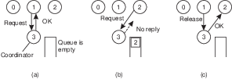
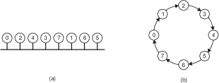
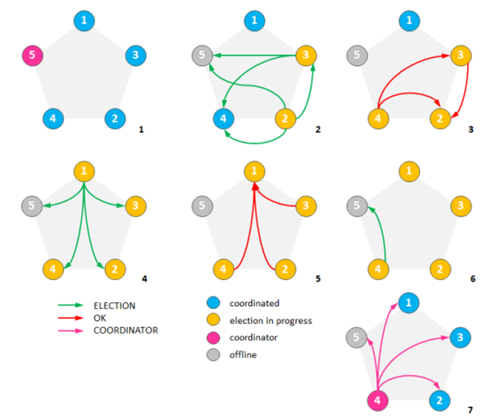
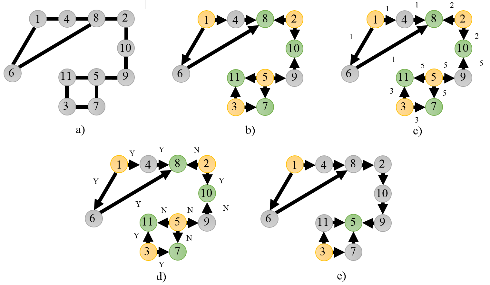

# Coordenação

## Exclusão Mútua

Como visto em [Concorrência](../concorrencia/concorrencia.md), diversas tarefas exigem coordenação entre threads em uma aplicação centralizada em que se faz uso de concorrência para melhor uso de recursos computacionais,  obtenção de melhor desempenho, modularização do código. 

Sistemas distribuídos levam a concorrência a um novo patamar de complexidade, fazendo uso de múltiplos processos, cada um com possivelmente múltiplos *threads*, ainda por cima, espalhados geograficamente. 
Contudo, ee em um sistema centralizado, uma variável global, um lock, ou outra primitiva de sincronização podem ser usadas na sincronização, em um sistema distribuído, primitivas simples como estas provavelmente não estarão disponíveis ou o sistema será muito restrito.

Um dos problemas enfrentados é o da exclusão mútua.

### Exclusão Mútua

Em um sistema distribuído, como controlar o acesso de múltiplos processos a um recurso compartilhado, garantindo que cada processo controla **exclusivamente** aquele recurso durante seu acesso?
Qualquer solução que se proponha a este problema problema de exclusão mútua, precisa ter as propriedades 1, 2 e 3, e, idealmente, também a 4, a seguir:

---
##### Exclusão Mútua

1. exclusão mútua: somente um processo pode estar na **região crítica** em qualquer instante de tempo;
2. ausência de *deadlocks*: se processos estão tentando acessar o recurso, então **algum processo deve conseguir acesso** em algum instante, dado que nenhum processo fique na região crítica indefinidamente;
3. não inanição: todos os processos interessados consguem, em algum momento, acessar o recurso;
4. espera limitada: idealmente, o tempo de espera pelo recurso é limitado.

---

Há diversas soluções para exclusão mútua em sistemas distribuídos, em diversos cenários e com resultados mais ou menos eficientes. Três das mais simples e que ilustram o universo de soluções são as seguintes:

---
##### Exclusão Mútua - Soluções

* Centralizado: Um processo acessa quando um coordenador diz que pode.
* Anel: Um processo acessa quando estiver com o ``token'' de acesso.
* Quorum: Um processo acessa quando houver acordo que é sua vez.

---

#### Centralizado

Enquanto em um sistema centralizado há um sistema operacional que  provê abstrações simples para os processos a serem coordenados, em um sistema distribuído, não há esta entidade coordenadora.
Uma possível solução para o problem de exclusão mútua em um ambiente distribuído é justamente dar um passo para trás e introduzir um coordenador.

Nesta abordagem, o seguinte protocolo é implementado:

* Participante:
  1. Envia requisição de acesso ao coordenador
  2. Espera por resposta do coordenador
  3. Acessa o recurso
  4. Envia liberação do recurso para o coordenador
* Coordenador
  1. Inicializa recurso como livre
  2. Ao receber requisição enfileira requisição
  3. Ao receber liberação, marca recurso como livre
  4. Sempre que recurso marcado como livre **E** fila não vazia: envie liberação para primeiro da fila e o remova da fila.

---
##### Centralizado

---

Este algoritmo tem diversas características positivas:

---
##### Prós

* Justo: requests são processados em ordem (FCFS)
* Não inanição
* Espera limitada
* Fácil de implementar, testar, entender

---

Contudo, tem também alguns aspectos negativos:

---
##### Contras

* Coordenador pode se tornar um gargalo;
* Como lidar com falhas? Processos não sabem se recurso está bloqueado ou se usuário morreu e não devolveu a permissão;
* Coordenador pode falhar e congelar o sistema.

---

Estes aspectos nos permitem mergulhar na área de tolerância a falhas, e o faremos, mas mais tarde. Por enquanto, consideraremos tolerância a falhas de forma superficial, após discutirmos outra abordagem abordagem.

#### Anel

Nesta abordagem, os processos se organizam em um anel lógico, com um processo antes e outro depois. Um dos processos é iniciado com um *token*, que dá acesso ao recurso e o *token* é passado adiante no anel; sempre que estiver de posse do token, o processo pode acessar o recurso. Ou seja, todos os participantes executam o seguinte protocolo:

* Participante:
  1. Ao receber o *token* de acesso, se quiser acessar o recurso, acessa.
  2. Envia o *token* para o próximo nó do anel.
  
---
##### Anel

---

Como o algoritmo centralizado, o algoritmo do anel também em suas vantagens e desvantagens.

---
##### Prós

* Justo: Todos acessam
* Não inanição
* Espera limitada
* Fácil de implementar, testar, entender

---

---
##### Contras

* *Token* passado para quem não necessariamente quer acessar;
* Tempo de espera linear no número de processos;
* Como lidar com falhas?

---

#### Lidando com falhas usando *timeouts*

Em ambos os algoritmos, centralizado e do anel, se um processo falhar, o algoritmo pode ficar "travado". Vejamos alguns casos específicos:

* No algoritmo centralizado, se o coordenador falha antes de liberar o acesso para algum processo, ele leva consigo a permissão.
* Em ambos os algoritmos, se o processo acessando o recurso falha, a permissão é perdida e os demais processos sofrerão inanição.
* No algoritmo do anel, se qualquer outro processo falha, o anel é interrompido o anel não conseguirá circular.

Observe que nem falamos de falhas dos canais e já temos diversos cenários a serem resolvidos, para os quais se lhes pedir uma solução, tenho certeza absoluta de que me ofereção alguma baseada em *timeouts*. Por exemplo, se o processo não devolver a permissão de acesso antes de um *timeout*, então assuma que o mesmo está falho e gere nova permissão, a ser passada a outros requisitantes.

O problema desta e outras "soluções" baseadas em *timeouts" está no **assumir que o processo está falho**, pois caso isso não seja verdade, teremos agora dois *tokens*  no sistema, podendo levar à violação da propriedade de exclusão mútua. Por mais que se ajuste o valor do temporizador, em um sistema distribuído assíncrono, o mesmo pode sempre estar errado. De fato, temos que

---
##### Impossibilidade de detecção de falhas

Em um sistema distribuído assíncrono, é impossível distinguir um processo falho de um processo lento.

---

Também mais tarde discutiremos as implicações desta impossibilidade. Por agora, pense apenas no seguinte: 

---
##### Pergunta:

Qual deve ser um *timeout*  razoável para o meu sistema?

---

A resposta depende de múltiplos fatores como:

---
##### ~~Resposta~~ Mais perguntas

* Qual o custo $E$ de esperar por mais tempo?
* Qual o custo $C$ de cometer um engano?
* Qual a probabilidade $p$ de cometer um engano?
* $C * p < E$

---

Embora esta análise possa ser feita para estes algoritmos, a verdade é que são realmente limitados e outras abordagens seriam melhor destino dos seus esforços.

---
> Se o mundo é probabilístico, porquê meus algoritmos devem ser determinísticos?"

Werner Fogels, CTO da Amazon.

---

Uma abordagem probabilística interessante é baseada em quóruns.

#### Quórum

De acordo com o [Dicionário Priberam da Língua Portuguesa, consultado em 17-04-2019](https://dicionario.priberam.org/quorum), "quórum" é o "Número de pessoas imprescindível para a realização de algo."
Aqui, este este algo será a liberação de acesso ao recurso almejado pelos processos no sistema distribuído.

Esta abordagem é semelhante em vários aspectos à centralizada. De fato, um dos papéis na abordagem é o de coordenador, que executa o mesmo protocolo que antes.

---
##### Quorum - Coordenador
1. Inicializa recurso como livre
2. Ao receber requisição enfileira requisição
3. Ao receber liberação, marca recurso como livre
4. Sempre que recurso marcado como livre **E** fila não vazia: envie liberação para primeiro da fila e o remova da fila.

---

Entretanto, em vez de apenas um coordenador no sistema, temos $n$, dos quais o participante precisa obter $m > n/2$ autorizações antes de acessar o recurso; $m$ é o quórum do sistema.

---
##### Quorum - Quórum

* $n$ coordenadores.
* $m > n/2$ coordenadores

---

---
##### Quorum - Participante

1. Envia requisição de acesso aos $n$ coordenadores
2. Espera por resposta de $m$ coordenadores
3. Acessa o recurso
4. Envia liberação do recurso para o coordenador

---

Além disso, para tornamos os problema mais interessante e demonstrar o potencial deste algoritmo, consideremos que as autorizações são armazenadas somente em memória, e que coordenadores, ao falhar e então resumir suas atividades, esqueçam-se  das autorizações já atribuídas.

---
##### Falhas

Quando um coordenador falha, esquece que deu ok e reseta seu estado.

---

Suponha o seguinte cenário:

---
##### Quórum - Exemplo

* Coordenadores = {$c_1,c_2,c_3,c_4,c_5,c_6,c_7$}
* $n = 7$
* $m = 4$
* Participante $p_1$ consegue autorização de {$c_1,c_2,c_3,c_4$} e entra na região crítica.
* Coordenador $c_4$ falha e se recupera
* Participante $p_2$ consegue autorização de {$c_4,c_5,c_6,c_7$} e entra na região crítica.
* **Exclusão Mútua** é violada.

---

Qual a probabilidade $P_v$ desta violação ocorrer?

---
##### Cálculo de $P_v$

* Seja $P$ a probabilidade de um coordenador falhar e se recuperar em $\delta t$, dentro de uma janela $T$.

* Probabilidade de falha de exatamente 1 coordenador
  * $P^1(1-P)^{n-1}$

* Probabilidade de $k$ coordenadores falharem?
  * $P^k(1-P)^{n-k}$

* Probabilidade de quaisquer $k$ em $m$ coordenadores falharem
  * $\binom{m}{k} P^k(1-P)^{m-k}$		

* Probabilidade de quaisquer $k$ em $m$ coordenadores falharem
  * $\binom{m}{k} P^k(1-P)^{m-k}$

* Diferentes valores de $k$ que são problemáticos?
  * TODO: desenho dos quóruns sobrepostos
  * $\left| A \cup B\right| = \left| A \right| + \left|B\right| - \left| A \cap B \right| \Rightarrow n = m + m - k$
  * $\left| A \cap B \right| = \left| A \right| + \left|B\right| - \left| A \cup B\right| \Rightarrow k = m + m - n = 2m - n$

* Probabilidade de quaisquer $k$ em $m$ coordenadores falharem, para qualquer $k$ que seja problemático
  * $P_v = \sum_{2m-n}^n \binom{m}{k} P^k(1-P)^{m-k}$

---

Para facilitar o entendimento desta grandeza, considere o exemplo:

---
##### Exemplo

* $p=0.0001$ (1 minuto a cada 10 dias)
* $n = 32$
* $m = 0.75n$
* $P_v < 10^{-40}$ ([Curiosidade sobre $10^40$](https://cosmosmagazine.com/mathematics/the-big-baffling-number-at-the-heart-of-a-cosmic-coincidence))

---

A probabilidade de violação da exclusão mútua, neste caso, é muito pequena, a despeito de suportar falhas dos coordenadores. 

---
##### Prós

* Tolera falhas de coordenadores, com probabilidade controlada de violação de exclusão mútua

---

Mas e as outras propriedades desejáveis do algoritmo de exclusão mútua, são alcançadas? Relembrando:

---
##### Exclusão Mútua

1. exclusão mútua: somente um processo pode estar na **região crítica** em qualquer instante de tempo;
2. ausência de *deadlocks*: se processos estão tentando acessar o recurso, então **algum processo deve conseguir acesso** em algum instante, dado que nenhum processo fique na região crítica indefinidamente;
3. não inanição: todos os processos interessados consguem, em algum momento, acessar o recurso;
4. espera limitada: idealmente, o tempo de espera pelo recurso é limitado.

---

---
##### Contras

* Exclusão Mútua: $1 - P_v$
* Não-inanição
  * E se cada participante obter o ok de um coordenador?
  * Temporizador para quebrar o *deadlock*?
* Espera limitada
  * Aborts podem levar a espera infinita.

---

Assim, este agoritmo também pode não ser adequado para certas situações. Vamos tentar reacessar os problemas da primeira abordagem.
Por um lado, o uso de um líder para coordenar ações em um SD simplifica o projeto, mas, por outro, o coordenador pode se tornar um ponto único de falha, como no algoritmo de exclusão mútua centralizado.
Mas e se substituíssemos o coordenador no caso de falhas? Este é o problema conhecido como eleição de líderes.

## Eleição de Líderes

O problema da escolha de um processo centralizador pode ser posto informamente como:

---
##### Eleição de Líderes

* Procedimento pelo qual um processo é escolhido dentre os demais processos.
* Todos os processos identificam o mesmo processo como eleito.
* Uma nova eleição deve acontecer sempre que o líder corrente se tornar indisponível.

---

Experimentemos com protocolos triviais. Vamos eleger um líder na sala. Do que precisamos?

---
##### Eleição de representante de sala

* Votação?
  * Identidade
* Teste de força?
* Estabilidade?

---

Antes de qualquer coisa, é preciso ser possível identificar um processo.

Como isso pode ser feito, na prática?

---
##### Identidade

* PID -- Process Identier
* IP -- Internet Protocol Address
* Socket -- IP + Port

---

### Algoritmo do Brigão (Bully)

* Selecione o processo ``vivo'' com o maior identificador!
* Quando $p$ acha que o líder está morto:
  * Envia mensagem ``eleição,$p$'' para todos os processo com identificador maior
  * Se ninguém responde, $p$ assume como líder
  * Se algum responde, aguarda notificação.
* Quando $q$ recebe ``eleição,$p$''
  * Envia ``ok'' para $p$
  * Fica ciente de que o coordenador atual está morto

* Ao assumir como líder, o processo notifica a todos os outros
* Se um processo falho se recupera, inicia uma eleição.

### Algoritmo do Anel

* Organize os nós em um anel lógico
* Quando $p$ acha que o líder está morto:
  * Envia mensagem \{$p$\} para ``a direita'' no anel.
  * Se processo à direita está falho, salte-o, e assim por diante.
* Quando $q$ recebe \{$p$\}
  * Envia  \{$p,q$\} para a direita.
* Quando $p$ recebe $S$ tal que $q \in S$
  * Escolhe menor id em $S$, por exemplo, e anuncia como líder.

### Chang & Robert's

* Organize os nós em um anel lógico
* Quando $p$ acha que o líder está morto:
  * Envia mensagem $p$ para ``a direita'' no anel, saltando falhos.
  * Liga flag ``participante''
* Quando $q$ recebe $p$
  * Se $p > q$, repassa $p$ para a direita.
  * Senão, envia  $q$ para a direita.
  * Liga flag ``participante''		
* Quando $p$ recebe $q$ da esquerda 
  * Se ``participante'' está ligado, identifica $q$ como líder.
  * Desliga ``participante''
  * Se $p \neq q$, repassa $q$ à direita

### Yo-Yo

* Grafos incompletos
* Duas fases

#### Fase 1
* $p$ envia seu identificador para seus vizinhos.
* Quando $q$ recebe $p$
  * Se $p>q$, adiciona aresta $q\rightarrow p$
  * Senão, adiciona aresta $q\leftarrow p$
  * Fonte (source)
  * Vertedouro (sink)
  * Interno

#### Fase 2

* Fontes enviam seus identificadores para seus vizinhos.
* Interno espera msg de todas as arestas de entrada, escolhe o menor id, e repassa para arestas de saída.
* Vertedouro espera msg de todas as arestas de entrada e escolhe o menor id.

#### Fase 2

* Vertedouro envia S para vizinhos de onde viu menor valor e N para os demais.
* Interno repassa S para o vizinho correspondente ao menor id e N para os demais.
* Fonte espera por todos os votos. Se todos são S, continua; caso contrário, desiste.
* N inverte a direção das arestas em que trafega.
* Possível otimizar para eliminar nós e arestas irrelevantes.

* a) The network
* b) Oriented network after setup phase
* c) YO- phase in which source values are passed
* d) -YO phase sending responses from sinks
* e) updated structure after -YO phase.

[Fonte YoYo: Hemis62 - Own work, CC BY-SA 4.0](https://commons.wikimedia.org/w/index.php?curid=36757409)

[Fonte Leader Election](https://en.wikipedia.org/wiki/Leader_election)

### Problemas?

O que acontece se a rede é particionada?

#### Split Brain

* Network Partitioning: rede dividida em duas partes incomunicáveis.
* Múltiplas eleições podem acontecer em paralelo.
* Múltiplos líderes em paralelo.
* Como lidar com este problema?	
  * Use primeiro algoritmo e só eleja líder após maioria de votos.
  * Rede redundante, disco compartilhado,... 
  * centralização... volta ao primeiro caso.

#### Detecção de Falhas

Eleição de líderes perfeita é impossível em cenários realísticos.

Detecção de falhas perfeita é impossível... 
em sistemas distribuídos assíncronos (Internet)  
sujeitos à partições (Internet)  
com requisitos de disponibilidade total.

Falemos mais sobre este problema depois.