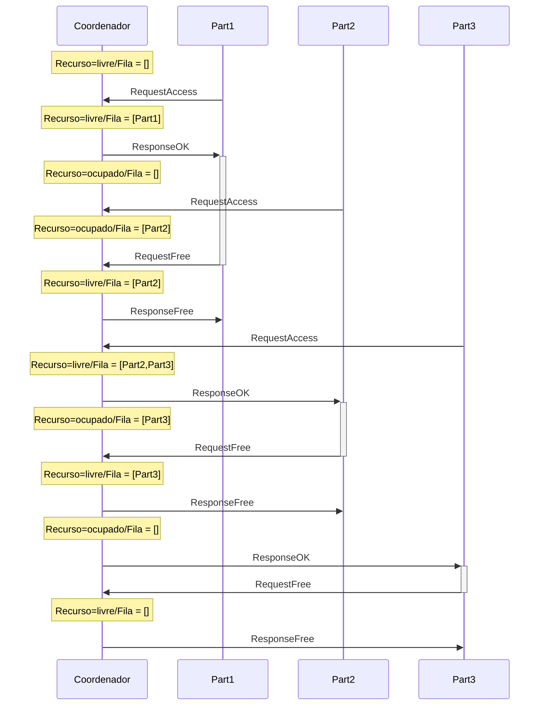
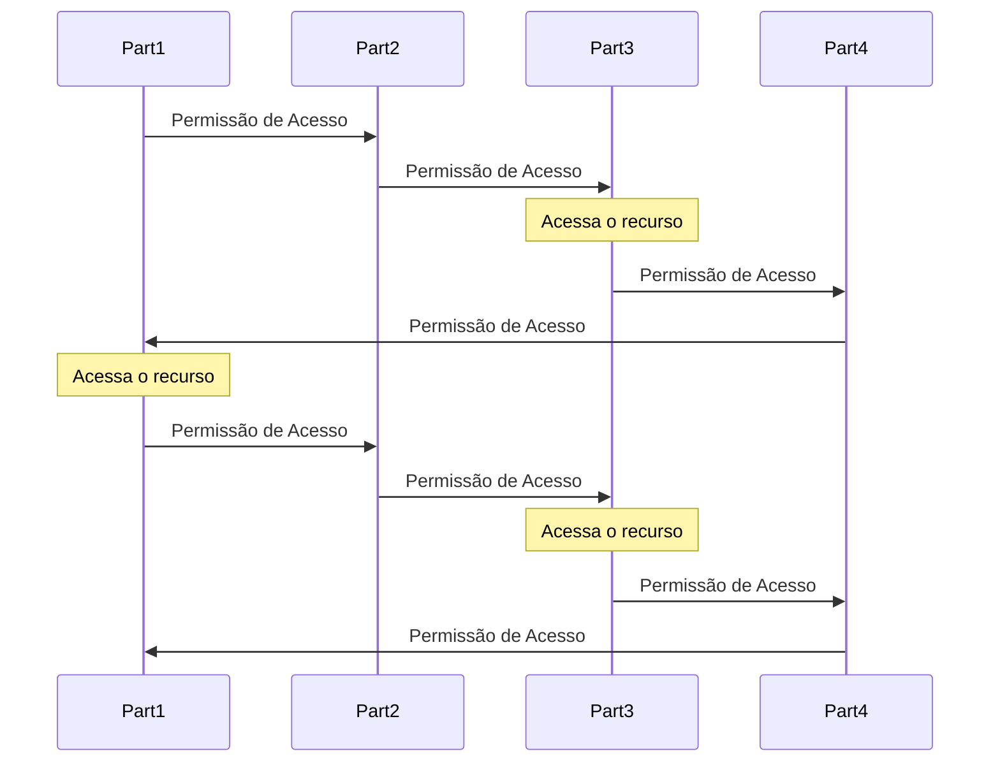
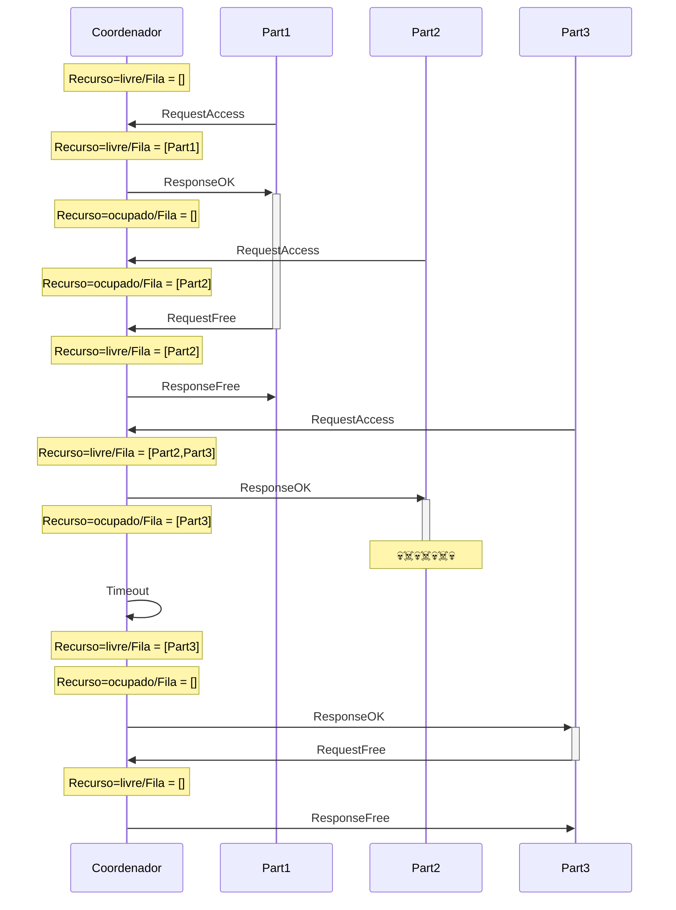
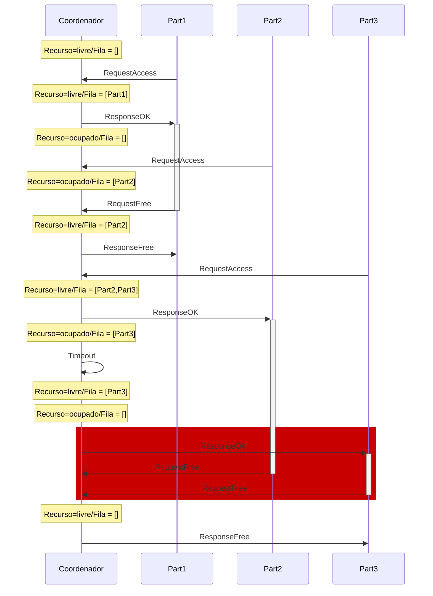

# Coordenação

Como visto na seção sobre [Multiprogramação](../basics/#multiprogramacao-e-multithreading-em-sistemas-distribuidos
../Multiprogramação concorrencia/concorrencia.md), diversas tarefas exigem coordenação entre threads em uma aplicação centralizada em que se faz uso de concorrência para melhor uso de recursos computacionais, obtenção de melhor desempenho, e modularização do código. 

Sistemas distribuídos levam concorrência a um novo patamar de complexidade, fazendo uso de múltiplos processos, cada um com possivelmente múltiplos *threads*, ainda por cima, espalhados geograficamente. 
Outras soluções e abstrações são portanto necessárias.

## Exclusão Mútua
Um dos problemas enfrentados em sistemas que fazem uso de concorrência, distribuídos ou não, é a exclusão mútua.
Em um sistema centralizado, uma variável global, um lock, ou outra primitiva de sincronização podem ser usadas na sincronização, mas em um sistema distribuído, primitivas simples como estas provavelmente não estarão disponíveis ou o sistema será muito restrito.
Como, então, controlar o acesso de múltiplos processos a um recurso compartilhado, garantindo que cada processo controla **exclusivamente** aquele recurso durante seu acesso?
Qualquer solução que se proponha a este problema de exclusão mútua, precisa ter as propriedades 1, 2, 3, e, idealmente, a 4, a seguir:

!!!info "Exclusão Mútua"
    1. **exclusão mútua** - somente um processo pode estar na **região crítica** em qualquer instante de tempo;
    2. **ausência de deadlocks** - se processos estão tentando acessar o recurso, então **algum processo deve conseguir acesso** em algum instante, dado que nenhum processo fique na região crítica indefinidamente;
    3. **não-inanição** - todos os processos interessados conseguem, em algum momento, acessar o recurso;
    4. **espera limitada** - idealmente, o tempo de espera pelo recurso é limitado.

Há diversas soluções para exclusão mútua em sistemas distribuídos, em diversos cenários, com seus prós e contras.
Três das mais simples, e que ilustram o universo de soluções são via um processo centralizador, em um anel em que a vez é circulada, e baseada em quoruns.

### Coordenador 

Enquanto em um sistema centralizado há um sistema operacional que  provê abstrações simples para os processos a serem coordenados, em um sistema distribuído, não há naturalmente tal entidade.
Uma possível solução para o problem de exclusão mútua em um ambiente distribuído é justamente dar um passo para trás e introduzir um coordenador.

Nesta abordagem, os processos que precisam acessar a região crítica são denominados **participantes** e um dos processos assume o pal de **coordenador**. É possível que um mesmo processo atue nos dois papéis sem nenhum prejuízo. Os processos executam o seguinte protocolo:

* Participante
    1. Envia requisição de acesso ao coordenador
    2. Espera por resposta do coordenador
    3. Acessa o recurso
    4. Envia liberação do recurso para o coordenador
* Coordenador
    1. Inicializa recurso como livre
    2. Ao receber uma requisição, a enfileira
    3. Ao receber uma liberação, marca o recurso como livre
    4. Sempre que recurso estiver marcado como livre **E** a fila não estiver vazia
        1. remove primeiro processo da fila
        2. envia liberação para processo removido
        3. marca o recurso como ocupado

O diagrama a seguir apresenta uma execução deste protocolo em um cenário com três participantes.
O estado do coordenador mostra se o recurso está livre ou ocupado e quais processos esperam por permissão de acesso.

```mermaid
sequenceDiagram
    participant Coordenador
    note over Coordenador: Recurso=livre/Fila = []
        Part1->>Coordenador: RequestAccess
    note over Coordenador: Recurso=livre/Fila = [Part1]
        Coordenador->>+Part1: ResponseOK
    note over Coordenador: Recurso=ocupado/Fila = []
        Part2->>Coordenador: RequestAccess
    note over Coordenador: Recurso=ocupado/Fila = [Part2]
        Part1->>-Coordenador: RequestFree
    note over Coordenador: Recurso=livre/Fila = [Part2]
        Coordenador->>Part1: ResponseFree
        Part3->>Coordenador: RequestAccess
    note over Coordenador: Recurso=livre/Fila = [Part2,Part3]
        Coordenador->>+Part2: ResponseOK
    note over Coordenador: Recurso=ocupado/Fila = [Part3]
        Part2->>-Coordenador: RequestFree
    note over Coordenador: Recurso=livre/Fila = [Part3]
        Coordenador->>Part2: ResponseFree
    note over Coordenador: Recurso=ocupado/Fila = []
        Coordenador->>+Part3: ResponseOK
        Part3->>-Coordenador: RequestFree
    note over Coordenador: Recurso=livre/Fila = []
        Coordenador->>Part3: ResponseFree
```

Este algoritmo satisfaz as características elencadas acima.   

* Exclusão mútua - se o coordenador autoriza um participante X, somente após o participante X liberar o recurso é que outro participante poderá obter nova autorização.
* Ausência de deadlocks - Todo processo que requisitar o recurso, entrará em uma fila, em apenas uma posição; assim, a fila proverá uma ordem total para os acessos, sem a possibilidade de circularidade nesta ordem.
* Não-inanição - Dado que ninguém fura a fila e que a cada vez que o recurso é liberado a fila anda, em algum momento a vez do processo chegará.
* Espera limitada - Dado que a posição na fila pode apenas decrementar, seria possível estimar quanto tempo o participante precisa esperar para acessar o recurso.

Outra vantagem deste algoritmo é sua simplicidade e, conseguentemente, facilidade de implementação.
Contudo, este algoritmo tem também desvantagens, por exemplo, se muitas requisições de acesso forem feitas, o coordenador pode ser sobrecarregado e se tornar um **gargalo** no acesso à região crítica.

Mais sério ainda é a questão de como lidar com falhas, por exemplo, se ou o coordenador ou o participante que detem o direito de acesso ao recurso para de funcionar,  então nenhum outro processo conseguirá acesso.
Estes aspectos nos permitem mergulhar na área de tolerância a falhas, e o faremos, mas mais tarde. 
Por enquanto, consideraremos tolerância a falhas de forma superficial, após discutirmos outra abordagem.

### Anel

Nesta abordagem, os processos se organizam em um anel lógico, com um processo antes e outro depois. 
Um dos processos é iniciado com um *token* que dá acesso ao recurso e o *token* é passado adiante no anel; sempre que estiver de posse do token, o processo pode acessar o recurso. Ou seja, todos os participantes executam o seguinte protocolo:

* Participante
    1. Ao receber o *token* de acesso, se quiser acessar o recurso, acessa.
    2. Envia o *token* para o próximo nó do anel.

O diagrama adiante mostra uma execução do algoritmo em que apenas os participantes 1 e 3 acessam o recurso.
  

```mermaid
sequenceDiagram
	Part1->>Part2: Permissão de Acesso
	Part2->>Part3: Permissão de Acesso
        note over Part3: Acessa o recurso
	Part3->>Part4: Permissão de Acesso
	Part4->>Part1: Permissão de Acesso
        note over Part1: Acessa o recurso
        Part1->>Part2: Permissão de Acesso
	Part2->>Part3: Permissão de Acesso
        note over Part3: Acessa o recurso
	Part3->>Part4: Permissão de Acesso
	Part4->>Part1: Permissão de Acesso
```

Como o algoritmo centralizado, o algoritmo do anel também garante as propriedades 1, 2, 3 e 4, além de ser fácil de implementar, testar e entender.
Diferente do algoritmo centralizado, o algoritmo do anel não sofre com problemas de gargalo, pois nenhum processo precisa participar em todos os acessos, como o coordenador.
Contudo, o algoritmo do anel desperdiça tempo passando o *token* para quem não necessariamente quer acessar a região crítica.
Também importante é que este algoritmo também sofre com falhas: se um participante falha enquanto com o *token*, levando-o para além.

### Lidando com Falhas 
Em ambos os algoritmos, centralizado e do anel, se um processo falhar, o algoritmo pode ficar "travado". 
Vejamos alguns casos específicos:

* No algoritmo centralizado, se o coordenador falha antes de liberar o acesso para algum processo, ele leva consigo a permissão.
* Em ambos os algoritmos, se o processo acessando o recurso falha, a permissão é perdida e os demais processos sofrerão inanição.
* No algoritmo do anel, se qualquer outro processo falha, o anel é interrompido o anel não conseguirá circular.

Observe que nem falamos de falhas dos canais e já temos diversos cenários a serem resolvidos, para os quais se lhes pedir uma solução, tenho certeza absoluta de que me oferecerão alguma baseada em *timeouts*.
Por exemplo, se o processo não devolver a permissão de acesso antes de que uma certa quantidade de tempo tenha passado, um *timeout*, então assuma que o mesmo parou de funcionar e não voltará mais, e gere uma nova permissão a ser passada a outros requisitantes.

```mermaid
sequenceDiagram
    participant Coordenador
    note over Coordenador: Recurso=livre/Fila = []
        Part1->>Coordenador: RequestAccess
    note over Coordenador: Recurso=livre/Fila = [Part1]
        Coordenador->>+Part1: ResponseOK
    note over Coordenador: Recurso=ocupado/Fila = []
        Part2->>Coordenador: RequestAccess
    note over Coordenador: Recurso=ocupado/Fila = [Part2]
        Part1->>-Coordenador: RequestFree
    note over Coordenador: Recurso=livre/Fila = [Part2]
        Coordenador->>Part1: ResponseFree
        Part3->>Coordenador: RequestAccess
    note over Coordenador: Recurso=livre/Fila = [Part2,Part3]
        Coordenador->>Part2: ResponseOK
    activate Part2
    note over Coordenador: Recurso=ocupado/Fila = [Part3]

    note over Part2: 💀☠️💀☠️💀☠️💀
    deactivate Part2
        Coordenador->>Coordenador: Timeout

    note over Coordenador: Recurso=livre/Fila = [Part3]
    note over Coordenador: Recurso=ocupado/Fila = []
        Coordenador->>+Part3: ResponseOK
        Part3->>-Coordenador: RequestFree
    note over Coordenador: Recurso=livre/Fila = []
        Coordenador->>Part3: ResponseFree
```

O problema desta e outras "soluções" baseadas em *timeouts* está no **assumir que o processo parou de funcionar**, pois caso isso não seja verdade, teremos agora dois *tokens*  no sistema, podendo levar à violação da propriedade de exclusão mútua. 

```mermaid
sequenceDiagram
    participant Coordenador
    note over Coordenador: Recurso=livre/Fila = []
        Part1->>Coordenador: RequestAccess
    note over Coordenador: Recurso=livre/Fila = [Part1]
        Coordenador->>+Part1: ResponseOK
    note over Coordenador: Recurso=ocupado/Fila = []
        Part2->>Coordenador: RequestAccess
    note over Coordenador: Recurso=ocupado/Fila = [Part2]
        Part1->>-Coordenador: RequestFree
    note over Coordenador: Recurso=livre/Fila = [Part2]
        Coordenador->>Part1: ResponseFree
        Part3->>Coordenador: RequestAccess
    note over Coordenador: Recurso=livre/Fila = [Part2,Part3]
        Coordenador->>+Part2: ResponseOK
    note over Coordenador: Recurso=ocupado/Fila = [Part3]

        Coordenador->>Coordenador: Timeout

    note over Coordenador: Recurso=livre/Fila = [Part3]
    note over Coordenador: Recurso=ocupado/Fila = []
    rect rgb(200, 0, 0)
        Coordenador->>+Part3: ResponseOK

        Part2->>-Coordenador: RequestFree
        Part3->>-Coordenador: RequestFree
    end
    note over Coordenador: Recurso=livre/Fila = []
        Coordenador->>Part3: ResponseFree
```

Por mais que se ajuste o valor do temporizador, em um sistema distribuído assíncrono, mesmo que aumentado com um relógio para medir a passagem do tempo local, o mesmo pode **sempre** estar errado. 

!!! warning "Impossibilidade de detecção de falhas"
    Em um sistema distribuído assíncrono, é impossível distinguir um processo falho de um processo lento.

Mais tarde discutiremos as implicações desta impossibilidade. Por agora, tentemos responder à seguinte questão.

!!! question
    Qual deve ser um *timeout*  **razoável** para o meu sistema?

A resposta depende de mais perguntas, como:

* Qual o custo $E$ de esperar por mais tempo?
* Qual o custo $C$ de cometer um engano?
* Qual a probabilidade $p$ de cometer um engano?

O custo esperado por causa dos erros, isto é, a esperança matemática da variável aleatória custo, é menor que o custo de se esperar por mais tempo, isto é, $C * p < E$?

Embora esta análise possa ser feita para estes algoritmos, a verdade é que são realmente limitados e outras abordagens seriam melhor destino dos seus esforços.
Por exemplo, podemos partir para a análise de algoritmos probabilísticos, pois afinal, como disse certa vez Werner Fogels, CTO da Amazon

> Se o mundo é probabilístico, porquê meus algoritmos devem ser determinísticos?"

Uma abordagem probabilística interessante é baseada em quóruns.

### Quórum

De acordo com o [Dicionário Priberam da Língua Portuguesa, consultado em 17-04-2019](https://dicionario.priberam.org/quorum), "quórum" é o  
> Número de pessoas imprescindível para a realização de algo.

Aqui, este este *algo* será a liberação de acesso ao recurso almejado pelos processos no sistema distribuído.

Esta abordagem é semelhante em vários aspectos à coordenada.
De fato, um dos papéis na abordagem é o de coordenador, que executa o mesmo protocolo que antes.
Entretanto, em vez de apenas um coordenador no sistema, temos $n$, dos quais o participante precisa obter $m > n/2$ autorizações antes de acessar o recurso; $m$ é o quórum do sistema.

!!! note "Quórum"
    * $n$ coordenadores.
    * $m > n/2$ coordenadores

Já os demais participantes devem agora considerar todo o conjunto de coordenadores antes de assumir que tem acesso a um recurso. O algoritmo completo é o seguinte:   

* Coordenador   
    1. Inicializa recurso como livre
    2. Ao receber uma requisição, a enfileira
    3. Ao receber uma liberação, marca o recurso como livre
    4. Sempre que recurso estiver marcado como livre **E** a fila não estiver vazia
        1. remove primeiro processo da fila
        2. envia liberação para processo removido
        3. marca o recurso como ocupado
* Participante
    1. Envia requisição de acesso aos $n$ coordenadores
    2. Espera por resposta de $m$ coordenadores
    3. Acessa o recurso
    4. Envia liberação do recurso para o coordenador

Além disso, para tornamos o problema mais interessante e demonstrar o potencial deste algoritmo, consideremos que as autorizações são armazenadas somente em memória, e que coordenadores, ao falhar e então resumir suas atividades, esqueceme das autorizações já atribuídas.

!!!warning "Perda de memória"
    Quando um coordenador falha, esquece que deu ok e reinicia seu estado.

Vejamos uma execução bem sucedida destes algoritmo:

???bug "TODO"
     Construir execução bem sucedida.

Este algoritmo é bom? Suponhamos o seguinte cenário:

* Coordenadores = {$c_1,c_2,c_3,c_4,c_5,c_6,c_7$}
* $n = 7$
* $m = 4$
* Participante $p_1$ consegue autorização de {$c_1,c_2,c_3,c_4$} e entra na região crítica.
* Coordenador $c_4$ falha e se recupera
* Participante $p_2$ consegue autorização de {$c_4,c_5,c_6,c_7$} e entra na região crítica.

Neste cenário, a propriedade de **Exclusão Mútua** é violada. 
Isto porquê, dados os dois quóruns, todos os processos na interseção foram reinicidaos.
Mas de forma geral, qual a probabilidade de isso acontecer? 
Ou seja, dados dois quoruns, de tamanho $m$, que se sobrepoem em $k$ processos, qual a probabilidade $P_v$ de que os $k$ processos na interseção sejam reiniciados e levem à violação?

Seja a $P$ a probabilidade de **um coordenador em específico falhar** e se recuperar dentro de uma janela de tempo $\delta t$. Temos

* Probabilidade de falha de **exatamente 1** coordenador: $P^1(1-P)^{n-1}$
* Probabilidade de **$k$ coordenadores** falharem: $P^k(1-P)^{n-k}$
* Probabilidade de quaisquer $k$ em $m$ coordenadores falharem: $\binom{m}{k} P^k(1-P)^{m-k}$		

Mas qual é o tamanho $k$ da interseção?

* $\left| A \cup B\right| = \left| A \right| + \left|B\right| - \left| A \cap B \right| \Rightarrow n = m + m - k$
* $\left| A \cap B \right| = \left| A \right| + \left|B\right| - \left| A \cup B\right| \Rightarrow k = m + m - n = 2m - n$

Até agora consideramos que a $k$ corresponde à cardinalidade da interseção dos dois quoruns, mas se mais do que a interseção forem reiniciados, também teremos problemas. Assim, se $k$ assume qualquer valor entre o tamanho da interseção e o número total de coordenadores, teremos problemas. 

* Probabilidade de quaisquer $k$ em $m$ coordenadores falharem, para qualquer $k$ variando de $2m-n$ a $n$: $P_v = \sum_{k=2m-n}^n \binom{m}{k} P^k(1-P)^{m-k}$

Para facilitar o entendimento desta grandeza, considere o exemplo:

* $P=0.0001$ (1 minuto a cada 10 dias)
* $n = 32$
* $m = 0.75n$
* $P_v < 10^{-40}$ ([Curiosidade sobre $10^{40}$](https://cosmosmagazine.com/mathematics/the-big-baffling-number-at-the-heart-of-a-cosmic-coincidence))

A probabilidade de violação da exclusão mútua, neste caso, é muito pequena, a despeito de suportar falhas dos coordenadores. 

!!! note "Pró"
    * Tolera falhas de coordenadores, com probabilidade controlada de violação de exclusão mútua.

Mas e as outras propriedades desejáveis do algoritmo de exclusão mútua, são alcançadas? Relembrando:

!!! note "Contras"
    * Exclusão Mútua probabilística: $1 - P_v$
    * Não-inanição
        * E se cada participante obtiver o ok de um coordenador?
        * Temporizador para quebrar o *deadlock*?
    * Espera limitada
        * Aborts podem levar a espera infinita.

Assim, este agoritmo também pode não ser adequado para certas situações. Vamos tentar reacessar os problemas da primeira abordagem.
Por um lado, o uso de um líder para coordenar ações em um SD simplifica o projeto, mas, por outro, o coordenador pode se tornar um ponto único de falha, como no algoritmo de exclusão mútua centralizado.
Mas e se substituíssemos o coordenador no caso de falhas? Este é o problema conhecido como eleição de líderes.

???bug "TODO"
    * Maekawa - Diminui número de votos necessários ([descrição](https://www.geeksforgeeks.org/maekawas-algorithm-for-mutual-exclusion-in-distributed-system/?ref=rp))
    * Lamport - Usa relógios lógicos, mas é possível entender sem este background ([descriçao](https://www.geeksforgeeks.org/lamports-algorithm-for-mutual-exclusion-in-distributed-system/))
    * Ricart-Agrawala - Melhora algoritmo de Lamport ([descrição](https://www.geeksforgeeks.org/ricart-agrawala-algorithm-in-mutual-exclusion-in-distributed-system/?ref=rp))
    * [Distributed-Mutual-Exclusion-slides](https://www.cs.cmu.edu/~dga/15-440/F09/lectures/Distributed-Mutual-Exclusion-slides.pdf)

## Eleição de Líderes

O problema da escolha de um processo centralizador, ou líder, pode ser posto informalmente como o procedimento pelo qual **um processo é escolhido** dentre os demais processos, sendo que o **processo escolhido é ciente da escolha** e **todos os demais processos o identificam como eleito**. Uma **nova eleição** deve acontecer sempre que o líder se tornar **indisponível**.
Para entendermos melhor o problema, tentemos desenvolver um protocolo simples para escolhermos um líder, por exemplo, em sua turma da disciplina de Sistemas Distribuídos. 

Em primeiro lugar, precisamos definir um conjunto de candidatos: são todos elegíveis ou apenas um subconjunto se candidata? 
Todos se conhecem ou há grupos incomunicáveis diretamente dentro da turma?
Mesmo que um colega seja bem conectado na turma, de que adianta ele ser líder se frequentemente não está presente quando necessário?
Em termos computacionais, estas questões são relevantes pois todos os processoes não nascem iguais; alguns residem em máquinas com mais memória, mais poder de processamento, melhor conexão com o resto do mundo ou maior grau de conectividade. Talvez este processo seja um líder mais útil que os demais.
Além disso, se o processo está frequentemente desconectado, mesmo que bem servido de recursos, não será um bom líder.

Em segundo lugar, ainda que assumamos um conjunto de processos indiferenciáveis entre si, com acesso equivalente a recursos e que estejam sempre disponíves, ou exatamente por isso, temos  um problem mais fundamental para resolver: para eleger um líder, precisamos identificar processos, de forma inequívoca. 
Dentro de uma única máquina, identificamos processos facilmente usando seu **pid**, ou *process id*, um inteiro associado a cada processoinstanciado pelo sistema operacional; o pid é válido enquanto o processo estiver executando e pode ser reciclado uma vez que o processo para de executar, o que pode ser um problema. Além disso, o *host* é reiniciado, os pid também são, e portanto esta identificação não é duradoura. Mais importante, o pid só faz sentido dentro de uma única máquina e não em um sistema distribuído.

Se apenas uma instância do processo executa em um mesmo *host*, então o identificador do *host* em si é suficiente e, de fato, comumente utilizado. Se mais de um processo executa no mesmo *host*, então cabe ao desenvolvedor criar um esquema que permita diferenciar os processos, e não precisa ser nada complicado; pode ser apenas um **parâmetro** passado na inicialização do processo ou a combinação **IP/porta**.

Assumindo um esquema de nomeação está disponível e que todos os processos se conhecem, voltemos ao problema de eleger um líder para sua turma.
Uma abordagem que pode funcionar é colocar todos os candidatos para brigar e quem sobrar em pé no final, é o novo líder.
A despeito desta opção gerar um líder não muito popular, o algoritmo do brigão é um clássico.

  

### Algoritmo do Brigão (*Bully*)
No algoritmo do brigão, alguma características comparável dos processos é escolhida e aquele processo funcional com o valor de tal característica mais vantajoso para um líder é escolhido como tal.
Por exemplo, pode ser vantajoso ter um líder com maior quantidade de memória, frequência da CPU ou largura de banda da conexão com a Internet; no caso de empate, o identificador do processo pode ser usado para gerar uma ordem total entre os processos.

Para simplificar, vamos assumir que o identificador do processo reflete as qualidades do mesmo para a liderança, tal que o maior identificador seja o melhor candidato. Os maiores processos, os "brigões", elimina os processos menores da competição, sempre que uma eleição acontecer. 
O algoritmo, é o seguinte, onde $p$ e $q$ são usados para representar tanto identificadores de processos quando os processos em si.

!!!note "Algoritmo do Brigão"
        * Quando $p$ suspeita que o líder não está presente
            * $p$ envia mensagem (ELEICAO,$p$) para todos os processos com identificador maior que $p$
            * Se $p$ não recebe (OK,$p$) de outros processos, envia (COORD,$p$) para todos os processos
            * Se algum responde, aguarda notificação do novo líder
	* Quando $p$ recebe (ELEICAO,$q$), $q < p$
            * Envia (OK,$p$)
	* Se um processo falho se recupera, inicia uma eleição
	
](./images/bully.png)

???todo "TODO"
      Explicar passos.
      Expandir próximos

	
	
### Algoritmo do Anel

!!!note "Algoritmo do Anel"
     * Organize os nós em um anel lógico
     * Quando $p$ acha que o líder está morto:
          * Envia mensagem {$p$} para "a direita" no anel.
              * Se processo à direita está falho, salte-o, e assim por diante.
     * Quando $q$ recebe {$p$}
          * Envia  {$p,q$} para a direita.
     * Quando $p$ recebe $S$ tal que $q \in S$
          *  Escolhe menor id em $S$, por exemplo, e anuncia como líder.

### Algoritmo de Chang & Robert 

!!!note "Algoritmo de Chang e Robert"
	* Organize os nós em um anel lógico
	* Quando $p$ acha que o líder está morto:
		* Envia mensagem $p$ para "a direita" no anel, saltando falhos.
		* Liga flag "participante"
	* Quando $q$ recebe $p$
		* Se $p > q$, repassa $p$ para a direita.
		* Senão, envia  $q$ para a direita.
		* Liga flag "participante"
	* Quando $p$ recebe $q$ da esquerda 
		* Se "participante" está ligado, identifica $q$ como líder.
		* Desliga "participante"
		* Se $p \neq q$, repassa $q$ à direita

### Algoritmo do YoYo 

[Fonte](https://en.wikipedia.org/wiki/Leader_election)

!!!note "Algoritmo do YoYo"
	* Grafos incompletos
	* Duas fases

	* Fase 1
		* $p$ envia seu identificador para seus vizinhos.
		* Quando $q$ recebe $p$
			* Se $p>q$, adiciona aresta $q\rightarrow p$
			* Senão, adiciona aresta $q\leftarrow p$
			* Fonte (source)
			* Vertedouro (sink)
			* Interno

	* Fase 2
	      * Fontes enviam seus identificadores para seus vizinhos.
	      * Interno espera msg de todas as arestas de entrada, escolhe o menor id, e repassa para arestas de saída.
	      * Vertedouro espera msg de todas as arestas de entrada e escolhe o menor id.

	      * Vertedouro envia S para vizinhos de onde viu menor valor e N para os demais.
	      * Interno repassa S para o vizinho correspondente ao menor id e N para os demais.
	      * Fonte espera por todos os votos. Se todos são S, continua; caso contrário, desiste.
	      * N inverte a direção das arestas em que trafega.
	      * Possível otimizar para eliminar nós e arestas irrelevantes.

Exemplo: 
](./images/yoyo.png)

* a) The network, 
* b) Oriented network after setup phase, 
* c) YO- phase in which source values are passed, 
* d) YO phase sending responses from sinks, 
* e) updated structure after -YO phase.

### Questões importantes

Problemas?

* Estabilidade?
* O que acontece se a rede é particionada?
    * Split Brain   
        * Network Partitioning: rede dividida em duas partes incomunicáveis.
        * Múltiplas eleições podem acontecer em paralelo.
        * Múltiplos líderes em paralelo.
        * Como lidar com este problema?	
              * Use primeiro algoritmo e só eleja líder após maioria de votos.
              * Rede redundante, disco compartilhado, centralização, volta ao primeiro caso.

* Detecção de Falhas
     * Eleição de líderes perfeita é impossível em cenários realísticos.
         * Detecção de falhas perfeita é impossível...
         * em sistemas distribuídos assíncronos (Internet)
         * sujeitos à partições (Internet)
         * com requisitos de disponibilidade total.
         * Falemos mais sobre este problema depois.
