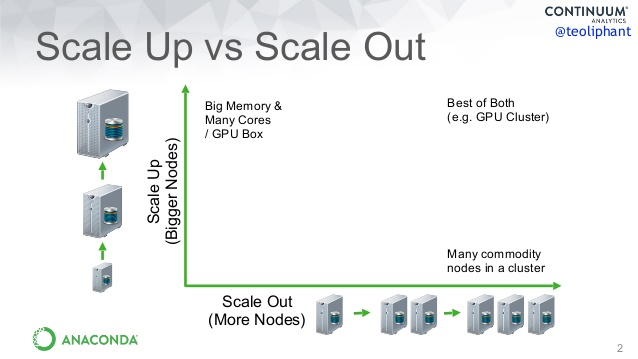
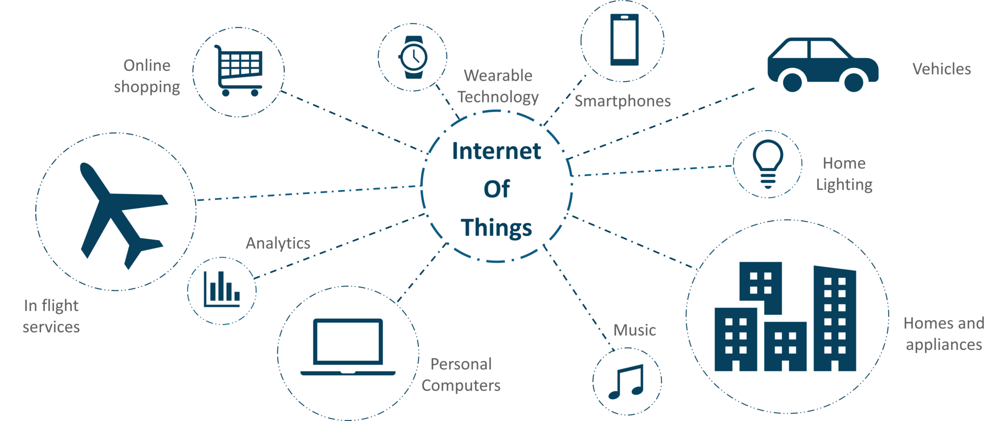
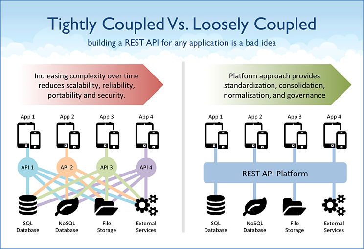
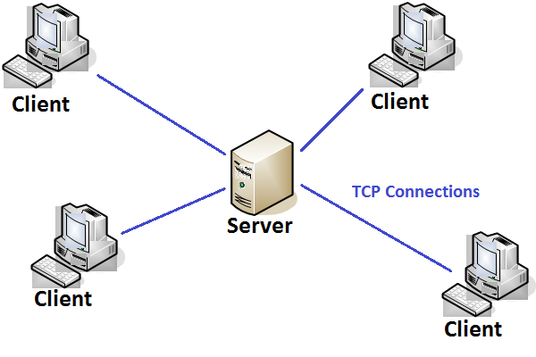
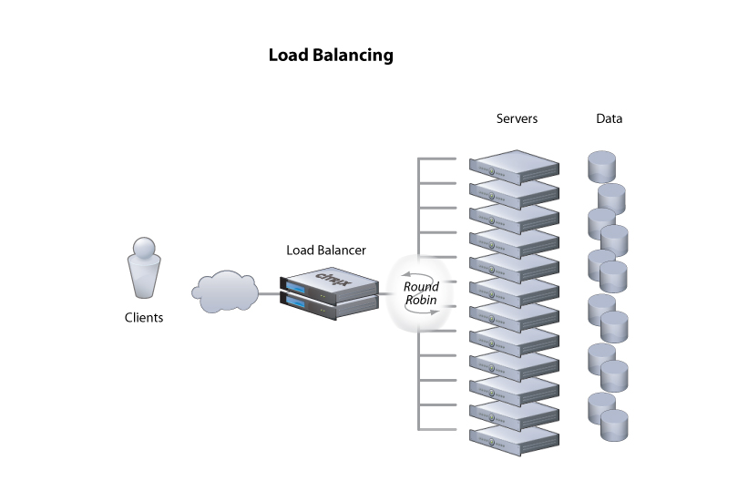
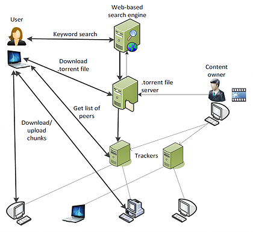

# Introdução

As áreas ligadas ao desenvolvimentos de sistemas computacionais, como Ciência e Engenharia de Computação e Sistemas de Informação, estão extremamente em voga e tem atraído mais e mais profissionais, mais ou menos qualificados, tornando este **mercado cada vez mais competitivo**.

Ter conhecimentos específicos da subárea de desenvolvimento de sistemas distribuídos e pode ser uma excelente vantagem e forma de se destacar de seus colegas e competidores.
"Como assim?", você pergunta, já que nunca ouviu falar em sistemas distribuídos até ter que se matricular nesta disciplina.
Bem, o desenvolvimento da teoria da computação distribuída, na forma do estudo de algoritmos e técnicas de implementação, e sua colocação em prática, na forma do desenvolvimento de sistemas distribuídos, não é tão "quente" como outras áreas, por exemplo inteligência artificial e ciência de dados.
Mas acontece que sem a computação distribuída, nenhum desenvolvimento sério destas outras áreas, sedentas por desempenho, escalaria para problemas reais. Veja por exemplo a seguinte descrição dos *skills* necessários para atuar como [cientista de dados](https://www.quora.com/What-skills-are-expected-from-a-data-engineer-not-a-data-scientist) ou como engenheiro no [Facebook](https://www.facebook.com/facebookcareers/videos/1747855735501113/).

Se estiver convencido de que esta é uma área importante, ótimo! 
 Neste curso apesentaremos uma visão geral do que são sistemas distribuídos, por quês técnicos para os desenvolvemos, e como fazê-lo, com uma forte componente prática, por meio do desenvolvimento de um projeto com (um dos) pés na realidade.
Caso contrário, bem, você não tem muita escolha, certo? Então tente aproveitar esta visão geral para praticar um pouco de [programação neuro-liguística](https://pt.wikipedia.org/wiki/Programa%C3%A7%C3%A3o_neurolingu%C3%ADstica) e repita o seguinte mantra: heeeeeeeuuuuummmmmm amo computação distribuída.

Brincadeiras a parte, você desenvolverá um projeto em várias etapas que lhe permitirá exercitar os conceitos vistos aqui e que te levará a:

* programar processos que se comuniquem via redes de computadores;
* conhecer arquiteturas clássicas de sistemas distribuídos (e.g, cliente/servidor, p2p e híbrida), seus usos e limitações;
* escrever programas *multithreaded* simples e a entender como o uso de *multithreading* afeta os componentes de um sistema distribuído;
* entender a problemática da coordenação e do controle de concorrência em sistemas distribuídos;
* entender o uso de sistemas de nomeação em sistemas distribuídos bem como diversas formas de se implementar tais sistemas de nomeação;
* entender os conceitos básicos de replicação e tolerância a falhas;
* entender as implicações da dessincronização de relógios na coordenação, replicação e tolerância a falhas;
* projetar sistemas com componentes geograficamente distantes, fracamente acoplados;
* entender onde os diversos *middleware* podem ser usados para acoplar tais componentes;
* conhecer várias técnicas que controle de concorrência controlar o acesso a um recurso compartilhado;


## O quê?

Todos estamos a par de que aplicações importantes nos dias de hoje são aplicações distribuídas rodando em grandes *data centers* com [milhares de máquinas](https://youtu.be/D77WDo881Pc).
Alguns exemplos óbvios são 

* [Amazon](https://www.amazon.com), 
* [Facebook](https://www.facebook.com), e 
* [GMail](https://www.gmail.com).

Mas as razões que levam a este cenário são válidas para diversas outras aplicações.
De fato, praticamente qualquer sistema de informação que precise atingir um público considerável, necessitará aplicar técnicas de computação distribuída para conseguir **escalar**, isto é, "ser grande", seja no número de clientes que atende (computacionais ou humanos), seja em sua área de cobertura, ou na qualidade do serviço que presta, mesmo que não cheguem a estas escalas. 

Este último ponto, sobre qualidade do serviço, tem a ver com a capacidade de um sistema se manter no ar a despeito de problemas, isto é, de ser tolerante a falhas. 
Tolerância a falhas implica em redundância, em cópias, o que fatidicamente implica em **distribuição** e em **Sistemas Distribuídos**.

De fato, há quem diga que [somos todos desenvolvedores de sistemas distribuídos agora](https://devclass.com/2019/08/16/pivotal-cto-kubernetes-means-were-all-distributed-systems-programmers-now/)


!!! note "Por quê distribuir?"
    As principais razões para se desenvolver sistemas distribuídos são duas, ambas resultantes da **agregação** (correta) do poder computacional de múltiplas máquinas:

    * escalabilidade e
    * tolerância a falhas.
 

Mas afinal, o quê é um sistema distribuído? Talvez seja mais fácil começarmos por sistemas não distribuídos, ou como normalmente os denominamos, sistemas centralizados.
Pense na maioria das aplicações que desenvolveu no curso até agora. Elas provavelmente executam integralmente em um único processo, executando em uma única máquina.
Mesmo que use diferentes bibliotecas e *frameworks*, toda lógica de negócio, armazenamento e interface com usuário está contida em um mesmo lugar, e por isso são chamadas centralizadas.
Quando começou a programar este tipo de aplicação, o trabalho era basicamente colar blocos Lego, que se encaixavam perfeitamente, bastando importar a biblioteca correta e invocar suas funções.


O cenário deve ter mudado um pouco no decorrer do curso e com o início de sua atividade profissional, quando passou a ter muito mais blocos, de muito mais tipos, para encaixar uns nos outros, aumentando consideravelmente a complexidade do desenvolvimento.
Mesmo que haja diferentes bibliotecas a serem usadas, com desenvolvedores e estilos diferentes, bem ou mal testadas, seus encaixes ainda fazem sentido.


Infelizmente, programar sistemas distribuídos é muito mais complexo que sistemas centralizados.
Frequentemente temos peças que nunca foram pensadas para trabalharem juntas, e nos resta  usar um pouco de *crazy glue*,


persuasão,


e muito arame. 
No caso, o arame é de um tipo especial conhecido como cabo de rede, usado para estabelecer um canal de comunicação entre as diferentes partes do sistema. 


De fato, a principal característica de um sistema distribuído em relação a um não distribuído, é a separação de suas partes em vários componentes independentes (processos, sensores, atuadores), mas que se coordenam por meio de canais de comunicação para execução de alguma tarefa.
Assim, uma possível definição de Sistema Distribuído, que me agrada, é a seguinte:

!!! note "Sistema Distribuído"
    Coleção de sistemas computacionais (software ou hardware), independentes mas com alguma forma de comunicação, que colaboram na execução de alguma tarefa.


Uma definição mais cínica mas definitivamente realista é a de [Leslie Lamport](https://en.wikipedia.org/wiki/Leslie_Lamport), que certa vez disse:
> A distributed system is one in which the failure of a computer you didn't even know existed can render your own computer unusable.
 
Mas se esta é a realidade da programação distribuída, por quê fazê-lo?


## Por quê?

Todos estamos a par de que aplicações importantes nos dias de hoje são aplicações distribuídas rodando em grandes *data centers* com [milhares de máquinas](https://youtu.be/D77WDo881Pc).
Alguns exemplos óbvios são

* [Amazon.com](https://www.amazon.com),
* [Facebook](https://www.facebook.com), e
* [GMail](https://www.gmail.com).

Mas as razões que levam a este cenário são válidas para diversas outras aplicações.
De fato, praticamente qualquer sistema de informação que precise atingir um público considerável, necessitará aplicar técnicas de computação distribuída para conseguir **escalar**, isto é, "ser grande", seja no número de clientes que atende (computacionais ou humanos), seja em sua área de cobertura, ou na qualidade do serviço que presta, mesmo que não cheguem a estas escalas.

Este último ponto, sobre qualidade do serviço, tem a ver com a capacidade de um sistema se manter no ar a despeito de problemas, isto é, de ser tolerante a falhas.
Tolerância a falhas implica em redundância, em cópias, o que fatidicamente implica em **distribuição** e em **Sistemas Distribuídos**.

Há quem diga que [somos todos desenvolvedores de sistemas distribuídos agora](https://devclass.com/2019/08/16/pivotal-cto-kubernetes-means-were-all-distributed-systems-programmers-now/).
O fato é que computadores individuais tem capacidade limitada de processamento e armazenamento, mas nossa necessidade de poder computacional cresce exponencialmente.


Assim, precisamos crescer nosso poder computacional, mas aumentar a capacidade de um dispositivo (**scale up**) mesmo de forma linear tem custo exponencial.


O que nos resta então é agregar o poder computacional de diversos computadores "baratos" (**scale out**) para satisfazer nossas necessidades.



O remédio, contudo, é bem amargo: com muitos computadores conectados, vem a necessidade de coordená-los, de forma a agir de forma coerente, mesmo quando alguns deles falhem, e quanto mais computadores, maior é a probabilidade de que pelo menos um deles tenha uma CPU, disco, fonte, ou que quer que seja, falhando.
E estejam certos, **computadores [falham](https://www.statista.com/statistics/430769/annual-failure-rates-of-servers/) o tempo todo!**

Nós precisamos então entender este ambiente e determinar

* qual a probabilidade de um nó falhar;
* como os computadores, ou melhor, como os processos se comunicam; 
* se mensagens podem ser perdidas, atrasadas, corrompidas;
* se os relógios dos computadores são sincronizados;
* se há agentes maliciosos que possam querer perturbar o sistema;
* quais os padrões de acesso ao serviços, isto é, se aumentam à noite, diminuem no verão, etc.

Assim, definimos **modelos computacionais**, que nos permitem desenvolver **algoritmos adequados** aos diversos problemas que enfrentamos.
Modelos clássicos englobam três variáveis:

* Comunicação;
* Sincronismo; e,
* Falhas.

Definido o modelo computacional, podemos distribuir nosso sistema, isto é, dividir a computação/armazenamento em diversas máquinas, e coordenar suas ações para que sejam consistentes com a especificação, de forma a minimizar o tempo que o serviço fica fora do ar, entregando o serviço de acordo com expectativas especificadas. Para isto, precisamos entender 

* como falhas (bugs, por exemplo) afetam a execução; 
* como evitar que a falha de algum componente possa levar o sistema a parar como um todo; e
* garantir que clientes em qualquer lugar do mundo tenham a mesma facilidade em acessar o serviço.

Vejamos algumas exemplos de tarefas executadas por sistemas distribuídos, que você usa hoje.

* Entregue este email para fulano@knowhere.uni.
* Envie o item X para este endereço, após cobrança de Y dinheiros da conta Z.
* Em um ambiente de simulação de batalhas em 3D, simule o disparo de um projétil nesta direção e sentido, com velocidade v, enquanto movimenta o avatar A para a esquerda.
* Autorize a transferência de X dinheiros da conta C para a conta C'.
* Movimente o braço mecânico que está segurando um bisturi, 3cm à direita, então abaixe-o 3mm, e movimente-o 4cm para a esquerda
* Inclua o comentário ``LOL!!!'' na lista de comentários do item XYZ, com marca de tempo T
* Leia o valor do sensor de temperatura S e, caso seu valor supere V, emita alarme luminoso vermelho intermitente e alarme sonoro

Um sistema distribuído implica em algum tipo de colaboração entre componentes, para permitir que recursos de um sejam usados por outro. 
Por exemplo, 

* capacidade de armazenamento, 
* de processamento, 
* conexão física com uma impressora, ou
* localização geográfica.


!!! note "Por quê distribuir?"
    As principais razões para se desenvolver sistemas distribuídos são duas, ambas resultantes da **agregação** (correta) do poder computacional de múltiplas máquinas:

    * escalabilidade e
    * tolerância a falhas.

## Como?

Apenas para reforçar, então, distribuir é

* dividir a computação/armazenamento em diversos componentes
* possivelmente geograficamente distribuídos
* coordenar suas ações para que resolvam a tarefa em questão de forma correta.

Com a distribuição objetiva-se

* usar recursos disponíveis nos hosts onde os componentes são executados
* e usar de redundância para garantir que o serviço sofra degradação graciosa em caso de falhas.

Para colaborar, as as diversas partes do sistema distribuído devem se comunicar.
Isto pode ser feito de diversas formas e em diversos níveis de abstração. Por exemplo:

* troca de mensagens,
* streams de dados,
* invocação remota de procedimentos
* ...

Implementar estas abstrações, para então desenvolver os sistemas distribuídos é complicado por quê os sistemas precisam ser coordenados em mínimos detalhes, a despeito das seguintes características:

* Falhas independentes
* Relógios dessincronizados
* Linguagens de desenvolvimento diferentes
* Sistemas operacionais diferentes
* Arquiteturas diferentes
* Desenvolvedores diferentes

Quero dizer, a complexidade de se implementar estas abstrações já é grande por si só. Se formos reinventar a roda a cada novo sistema, não faremos muitos avanços.
Mas, como vocês sabem, sistemas computacionais são como ogros (muito feios, às vezes), que por sua vez, são como cebolas (cheias de camadas), que nos fazem chorar quando precisamos descascá-las.


Felizmente, para cada problema que tenha que resolver, há uma boa probabilidade de que alguém já tenha atacado o problema e disponibilizado uma solução, de forma comercial ou não.
Com sistemas distribuídos, não é diferente, e no caso da comunicação entre componentes distribuídos, a solução normalmente é usar um *middleware*.

---
##### Middleware

O *middleware*  é a camada *ware* que fica no *middle*, entre, o *software* e o *hardware*. 
Software, no caso, é a aplicação distribuída, e hardware é a **abstração** do *host*  em que executam os componentes, provida pelo sistema operacional.
Uso aqui o termo **abstração** porquê o sistema operacional pode encapsular o hardware, mas também pode encapsular outra abstração hardware, por exemplo, um máquina virtual.

---
##### Middleware


> The software layer that lies between the operating system and applications on each side of a distributed computing system in a network.

---

Segundo, [Sacha Krakowiak](https://web.archive.org/web/20050507151935/http://middleware.objectweb.org/), as principais funções do middleware são:

* esconder a distribuição e o fato de que um aplicação é geralmente composta por múltiplas partes, executando em localizações geograficamente distintas,
* esconder a heterogeneidade dos vários componentes de hardware, sistemas operacionais e protocolos de comunicação
* prover interfaces uniformes, de alto nível e padronizadas para os desenvolvedores de aplicação e integradores, de forma que aplicações possam ser facilmente compostas, reusadas, portadas e feitas interoperáveis.


Assim, os middleware facilitam a conexão entre nós e permitem o uso de protocolos mais abstratos que "mandar um monte de bytes" para lá e para cá, escondendo a complexidade da coordenação de sistemas independentes.
Desenvolver sistemas distribuídos sem usar um middleware é como desenvolver um aplicativo qualquer, sem usar bibliotecas: possível, mas complicado, e estará certamente reinventando a roda. Isto é, você praticamente tem que refazer o middleware antes de desenvolver o sistema em si.

Idealmente, com o middleware se obteria transparência total do fato da aplicação estar distribuída, levando o sistema, uma coleção de sistemas computacionais (software ou hardware) independentes, a se apresentar para o usuário como **um sistema único**. 
Pense no browser e na WWW: quanto você sabe sobre as páginas estarem particionadas em milhões de servidores?

Podemos quebrar esta "transparência total" em várias transparências mais simples.
Vejamos cada uma destas separadamente.

---
##### Transparências

* Acesso
* Localização
* Relocação
* Migração
* Replicação
* Falha

---

### Transparência de Acesso

A transparência de acesso diz respeito à representação de dados e mecanismos de invocação (arquitetura, formatos, linguagens...).
Cada computador tem um arquitetura e uma forma de representar, por exemplo, números, e se dois componentes de um SD executam em máquinas com arquiteturas diferentes, como trocam números em ponto flutuante?


---
##### IEEE FP


* Half Precision (16 bit): 1 sign bit, 5 bit exponent, and 10 bit mantissa
* Single Precision (32 bit): 1 sign bit, 8 bit exponent, and 23 bit mantissa
* Double Precision (64 bit): 1 sign bit, 11 bit exponent, and 52 bit mantissa
* Quadruple Precision (128 bit): 1 sign bit, 15 bit exponent, and 112 bit mantissa

[Fonte](https://www.tutorialspoint.com/fixed-point-and-floating-point-number-representations)

---

A mesma questão é válida para representações de strings e classes, e diferenças de sistemas operacionais e linguagens.
Assim, para se tentar obter transaparência de acesso, é importante que se use padrões implementados em múltiplas arquiteturas.

---
##### Transparência de acesso

Usar padrões abertos e interfaces bem definidas.
* Sistemas bem comportados e previsíveis (RPC/ASN.1)
* Que interajam bem com outros via interfaces bem definidas (REST)
* Suportem aplicações diferentes do mesmo jeito (API)

---

### Transparência de Localização

A transparência de localização diz respeito a onde está o objeto: pouco importa ao usuário, se o serviço está dentro da mesma máquina em que acessa o serviço, se na sala do lado, ou na nuvem, do outro lado do globo, desde que o serviço seja provido de forma rápida e confiável.
A esta transparência é essencial uma boa distribuição do serviço, sobre uma rede com baixa latência, ou o uso de técnicas que permitam esconder a latência.

---
##### Escondendo a Latência

* *Caching* de dados <br>
  Em vez de sempre buscar os dados no servidor, mantenha cópias locais dos dados que mudam menos (e.g., o CSS do stackoverflow).
* Use de comunicação assíncrona e paralelismo
  * Em vez de validar formulário após preenchimento de cada campo, valide em paralelo enquanto usuário preenche o campo seguinte.
  * Use um callbacks para indicar campos com problemas a serem corrigidos.
* Nem todo problema é paralelizável, por exemplo, autenticação

---

Outra forma de diminuir latência é trazer para próximo do usuário parte da computação.
Isto é comumente feito com a interface com usuário,  mas pode ser usado também para outras partes do sistema. 
Como exemplo do primeiro, pense em consoles de video-game que fazem o processamento gráfico pesado na casa do usuário, de jogos online.
Como exemplo do segundo, pense em aplicativos que mantém os dados em celulares até que uma boa conexão, por exemplo WiFi, esteja disponível para sincronizar com o servidor.


---
##### Escondendo a latência

* Distribua tarefas
  * Delegue computação aos clientes<br>
    E.g., JavaScript e Applets Java.
  * Particione dados entre servidores<br>
    E.g., Domain Name Service e World Wide Web.
* Aproxime dados dos clientes
  * Mantenha cópias de dados em múltiplos lugares.
  * Atualize dados de acordo com necessidade.<br>
	E.g., cache do navegador.


### Transparência de Relocação

As vezes os objetos precisam ser movimentados de uma localização à outra.
Se implementadas corretamente, as técnicas que entregam transparência de localização não deixam que o cliente perceba a movimentação, no que chamamos transparência de Relocação.

---
##### Transparência Localização e Relocação

* Rede de baixa latência
* Distribuição inteligente
  * E.g: Serviços de nome
* Múltiplas cópias
  * Cópias temporárias

---

### Transparência de Migração

Do ponto de vista do próprio serviço, não perceber que se está sendo movimentado é chamado transparência de Migração.
Um serviço com esta propriedade, não precisa ser parado e reconfigurado quando a mudança acontece.
Uma das formas de se implementar esta propriedade é através da migração provida por máquinas virtuais, usado, por exemplo, para consolidar o uso de servidores em nuvens computacionais.

---
##### Transparência de Migração


---

Na verdade, a movimentação neste cenário, é uma cópia da máquina virtual. Uma vez que a cópia esteja próxima do fim, a imagem original é congelada, a cópia concluída, e há um chaveamento na rede para se direcionar toda comunicação para nova cópia. O máquina original é então descartada.

### Transparência de Replicação

A capacidade de ter cópias de um serviço e de direcionar trabalho de uma para outra é também útil para se obter transparência no caso de falhas.
Isto porquê para se manter um serviço funcional a despeito de falhas, é preciso ter múltiplas cópias, prontas para funcionar a qualquer momento.

Dependendo das garantias desejadas na manutenção da **consistência** entre as cópias, o custo pode varia muito, de forma que para se ter um custo menor, tem-se garantias mais fracas, por exemplo, que as réplicas tem um **atroso** entre elas de $X$ minutos. Este é um dilema parecido com o TCP x UDP, em que mais garantias implicam em maior custo de comunicação.

Algumas aplicações toleram inconsistências e podem viver com menores custos. Um exemplo famoso é o dos "carrinhos de compra" da [Amazon.com](https://www.allthingsdistributed.com/2008/12/eventually_consistent.html), que podem fechar pedidos com conteúdo diferente do desejado pelo cliente.

Outras aplicações são normalmente construídas com requisitos de consistência forte entre as réplicas, como sistemas financeiros.
Para estas aplicações, uma técnica importante para se conseguir replicação é o uso de frameworks de comunicação em grupo, que entregam para múltiplas instâncias de um mesmo serviço, as mesmas mensagens, permitindo que elas se mantenham como cópias.
Esta técnica funciona se os serviços forem máquinas de estado determinísticas, que consideram como eventos as mensagens entregues pelo protocolo de comunicação em grupo.

---
##### Máquina de Estados

* Comunicação em grupo
* 
* Máquina de Estados Replicada

---


---
##### Replicação x Inconsistências

* Múltiplas cópias  em sincronização  custos
* Dado precisa ser consistente entre réplicas (mesmo valor em todo lugar) 
* Protocolos de invalidação de cache.
* Muita largura de banda.
* Baixa latência.

---


### Transparência de Concorrência

Outra transparência almejável é de concorrência. 
Isto é, quem acessa um serviço deveria ser indiferente ao fato de que o mesmo pode estar sendo acessado por outros.
Isto é importante tanto em termos de segurança, no sentido de que um cliente não deveria acessar os dados do outro, caso isso seja um requisito do sistema, quanto tem termos de desempenho.
Novamente, nuvens computacionais são um exemplo de onde este tipo de transparência é essencial.

Considere um serviço de banco de dados em uma nuvem qualquer. Para prover a mesma interface com a qual usuários estão acostumados a anos, é possível que este serviço seja simplesmente um *wrapper* ao redor do SGBD que se comprava e instalava *in-house* anteriormente.
Para se tornar viável, contudo, uma mesma instância deve servir múltiplos clientes, os *tenants*, sem que a carga de trabalho introduzida por um, interfira no desempenho do outro. No meio, chamamos esta propriedade de *multi-tenancy*, mas é apenas um exemplo de transparência de concorrência.

---
##### Multi-tenancy

* 

---

Esta propriedade está fundamentalmente ligada à escalabilidade, isto é, à adequação dos pool de recursos às demandas dos clientes: se mais clientes estão presentes, então aumente a quantidade de servidores e separe as cargas; se menos clientes estão presentes, então desligue algumas máquinas e economize recursos.

---
##### Transparência Concorrência

* controle de concorrência adequado.
* mecanismos para alcançar *escalabilidade* (particionamento/*sharding*)

---

### Desafios para se obter transparência

Apesar de desejáveis, as transparência discutidas são difíceis de se conseguir, principalmente se em conjunto.
Isto porquê, do **ponto de vista de usuários** espalhados pelo globo, atrás de redes heterogêneas e com possibilidade de erros, acontecerão atrasos e perdas na comunicação, denunciando a distribuição.

Do **ponto de vista do desenvolvedor**, é preciso tomar decisões baseado em premissas ligadas à realidade da rede. Por exemplo, se uma requisição não foi respondida, quanto tempo um cliente deve esperar antes de reenviá-la, possivelmente para outro servidor, sem incorrer em risco significativo da requisição ser processada duas vezes? A resposta para esta pergunta é muito mais complicada do que pode parecer.

**De forma geral**, qualquer aumento de transparência tem um custo, seja em termos monetários (e.g., contratação de link dedicado ou de host em outra posição geográfica), ou em termos de desempenho (e.g., coordenar a entrega de mensagens em sistemas de comunicação em grupo).

Provavelmente os maiores obstáculos para se alcançar os diversos tipos de  transparência são impostos pela parte da infraestrutura que torna o sistema distribuído possível, a rede.
Para entender o porquê, vejamos algumas premissas normalmente assumidas sobre a rede que não são, definitivamente, verdade.

---
##### Armadilhas da rede

* A latência é zero.
* A largura de banda é infinita.
* A rede é confiável.
* A rede é segura.
* A rede é homogênea.
* A rede é estática.
* A rede tem acesso grátis.
* A rede é administrada por você ou alguém acessível.

---


Para terminar, deixem-me apenas retomar um termo usado acima, **escalabilidade**.
O termo está muito em voga e é usado, normalmente, para descrever a capacidade de um sistema de se adequar a variações de carga de trabalho.
Embora seja um uso válido, há outros tipos de escalabilidade.

---
##### Escalabilidade

* Escalabilidade
  * Tamanho: Número de usuários que suporta.
  * Geográfica: Região que cobre.
  * Administrativa: Número de domínios administrativos.
* Há várias possibilidades: seja específico e exija especificidade.

---
layout: default
title: Tipos
parent: Introdução
nav_order: 4
---

# Tipos e Arquiteturas

Diversos são as finalidades dos sistemas distribuídos que construímos, assim como são diversas as arquiteturas que usamos.
Classificar os tipos e arquiteturas nos ajuda a pensar sobre sistemas e a encontrar e reusar soluções previamente testadas. 

## Tipos

### Sistemas de Computação - High Performance Computing

A possibilidade de agregar poder de processamento de muitos computadores em um rede de comunicação com altíssima largura de banda nos permite atacar problemas computacionalmente muito intensos.
Clusters como o da imagem a seguir são compartilhados por pesquisadores resolvendo problemas áreas como bio-informática, engenharia, economia, inteligência artificial, etc.


Na engenharia, por exemplo, HPC pode ser usada para testar a eficiência de projetos sem construir protótipos, seja
* de uma turbina <br>

* um carro <br>

* ou uma vaca <br>


### Sistemas de Informação

Provavelmente mais comuns entre os profissionais da computação, os sistemas de informação distribuídos permitem a são encontrados em diversas formas (de fato, o termo "sistema de informação" é tão abrangente, que dificilmente um sistema distribuído não estaria nesta classe.).


O seguinte é um exemplo de uma arquitetura em três camadas, onde a primeira camada faz interface com o usuário, a segunda camada contém a lógica do negócio, e a terceira camada mantem os dados.

[](https://en.wikipedia.org/wiki/Multitier_architecture)

Peça fundamental desta abordagem, os bancos de dados na terceira camada são, muito frequentemente, transacionais.
Isto é, eles provêem as seguintes garantias na execução de transações, as famosas propriedades ACID:

---

* Atomicidade: transações são tratadas de forma indivisível, isto é, ou tudo ou nada.
*  Consistência: transações levam banco de um estado consistente a outro<br>
	E.g., x == 2*y
* Isolamento: transações não vêem dados não comitados umas das outras.
* Durabilidade: os efeitos de uma transação comitada devem persistir no sistema a despeito de falhas.

---

Para relembrar o que querem dizer as propridades, considere a seguinte sequência de operações:

```
1: a = SELECT X
2: c = a * 2
3: b = c + 10
4: SET X=c
5: SET Y=b
````
Suponha duas instâncias desta sequência, $T_1$ e $T_2$, concorrentes, em que as operações escalonadas da seguinte forma, onde $T_x^y$ é a y-ésima operação de $T_x$.

$T_1^1, T_1^2, T_1^3, T_1^4, T_2^1, T_2^2, T_2^3, T_2^4, T_2^5, T_1^5$

Ao final da execução, X terá o valor atribuído por $T_2$, mas $Y$ terá o valor de $T_1$. 
Este escalonamento violou a consistência do banco de dados por quê as operações não foram executadas isoladamente.


Tente imaginar a dificuldade de se implementar um banco de dados distribuído. Isto é, um banco em que vários nós mantem os dados, participam de transações e, portanto, precisam coordenar-se para manter os dados consistentes. A figura abaixo mostra um cenário com três bancos. Imagine que em um deles está uma relação com os dados dos clientes. Em outro, os dados do estoque. Finalmente, no terceiro nó, temos ordens de compra. Quando um cliente faz um pedido, o cliente deve ser validado no primeiro nó, o item é removido do estoque no segundo nó, e no terceiro é disparada uma cobrança para o cliente. Se qualquer destas três relações não for corretamente consultada e alterada, os efeitos podem ser catastróficos para o negócio.


Como implementar ACID neste banco de dados? Embora veremos isso um pouco mais para frente neste material, por enquanto, apenas assuma que não é exatamente fácil ou barato. Esta dificuldade foi a razão do surgimento dos bancos de dados NOSQL (née NoSQL).


Em tempo, discutiremos como estes bancos de dados funcionam, quando falarmos sobre sistemas P2P.


#### Integração de Aplicações

Frequentemente é necessário integrar sistemas de informação legados com sistemas mais modernos, ou simplesmente expô-los usando uma interface mais moderna. Nestes casos, pode ser possível integrar diversos sistemas usando um *middleware* que os encapsule.


O *middleware* pode, por exemplo, se expor via interface REST para os clientes, mas consultar o sistema legado em um padrão antigo.

Outro exemplo é o sistema na imagem seguinte, que mostra diversos departamentos de um empresa conversando via troca de mensagens. Observe que nenhum departamento precisa conversar diretamente com os outros, ou mesmo conhecê-los. Eles apenas publicam a mensagem para quem puder tratar. Da mesma forma, a resposta vem na forma de uma mensagem.


Siga este [link](https://engineering.linkedin.com/distributed-systems/log-what-every-software-engineer-should-know-about-real-time-datas-unifying) para ler mais sobre este tipo de sistema.

### Sistemas Pervasivos/Ubíquos

Segundo Weiser, 1993
> Ubiquitous computing is the method of enhancing computer use by making many computers available throughout the physical environment, but making them effectively invisible to the user".

O que é importante aqui é o foco na tarefa em vez de na ferramenta. Assim, sistemas pervasivos devem ajudar as pessoas a realizar suas tarefas, de forma implícita, sem ter que pensar em como a tarefa será executada.
Para que seja realizada, a computação pervasiva requer que dispositivos **detectem o contexto** em que estão inseridos, **combinem-se de forma *ad-hod*** e **compartilhem informações**.

Alguns exemplos interessantes de computação pervasiva.

#### Smart Life

<iframe width="560" height="315" src="https://www.youtube.com/embed/M08fVm6zVyw" frameborder="0" allow="accelerometer; autoplay; encrypted-media; gyroscope; picture-in-picture" allowfullscreen></iframe>

#### Amazon Go

<iframe width="560" height="315" src="https://www.youtube.com/embed/zdbumR6Bhd8" frameborder="0" allow="accelerometer; autoplay; encrypted-media; gyroscope; picture-in-picture" allowfullscreen></iframe>

#### Minority Report

E, para quem já viu Minority Report, aqui vai um reality check.

<iframe width="560" height="315" src="https://www.youtube.com/embed/RJ4KxaWraJc" frameborder="0" allow="accelerometer; autoplay; encrypted-media; gyroscope; picture-in-picture" allowfullscreen></iframe>

#### Redes de Sensores e Internet das Coisas

Eu vou me arriscar colocando Redes de Sensores e Internet das Coisas como uma subsessão de Sistemas Pervasivos.
Isto porquê, a meu ver, as redes de sensores são parte da infraestrutura para se obter sistemas pervasivos; são os sensores que percebem mudanças contexto e "leêm" o estado do contexto atual e alimentam outros sistemas que reagem a tal estado.
A Internet das Coisas (IoT, do inglês *Internet of Things) vai também na mesma linha, levando à integração entre sensores, atuadores, e outros dispositivos que nos servem, em um ambiente de computação pervasiva.
"Mas se é assim, qual o risco?", você pergunta. Bem, a Internet das Coisas pode ser vista como algo além dos sistemas pervasivos, pois se estes últimos são focados nos humanos em um certo contexto, a IoT não necessariamente foca-se nos humanos, mas na realização de alguma tarefa. 
Por exemplo, um sistema de irrigação que percebe o nível de humidade do ar, analisa previsões de chuva e decide em quanto irrigar uma plantação de laranjas provavelmente não se importará com a presença ou não de um humano na plantação.



Para ler mais sobre IoT, veja este [link](https://publications.europa.eu/en/publication-detail/-/publication/ed079554-72c3-4b4e-98f3-34d2780c28fc) que descreve diversos projetos europeus na área.


<h1> TODO Alguns exemplos de IoT e redes de sensores</h1>

* Smart grid e lavadora que escolhe horário
* Termostatos que percebem movimento
* Fechaduras que se abrem quando o dono se aproxima
* Movimentação de tropas e de fauna
* Índices de poluição
* Abalos sísmicos e predição de avalanches
* [link](https://beebom.com/examples-of-internet-of-things-technology/)


#### Uma nota sobre privacidade nos sistemas pervasivos

À medida em que aumentamos o ambiente ao nosso redor ou a nós mesmos com dispositivos computacionais, por um lado facilitamos nossa vida pois somos assistidos por tais dispositivos, mas por outro, nos tornamos cada vez mais dependentes nos mesmos, com sérios riscos à nossa privacidade.
Isto ocorre por que para que realizem suas tarefas, os sistemas pervasivos precisam de cada vez mais informações sobre nós, e há sempre o risco de que estas informações sejam usadas de forma que não nos apetece.

<h1> TODO Exemplos de problemas de privacidade. </h1>

* [Roomba mapeando sua casa](https://www.nytimes.com/2017/07/25/technology/roomba-irobot-data-privacy.html).
* Ghost in the shell
* Snow crash (Neil Stephenson)

### Computação Utilitária

Um tipo importante de sistema distribuído mais recente são as nuvens computacionais, usadas no provimento de computação utilitária.
Este tipo de sistema, embora possa ser pensando como infraestrutura para outros sistemas distribuídos, são, na verdade, complexas peças de engenharia, com diversos subsistemas responsáveis por sincronização de relógios, monitoração de falhas, coleta de logs, roteamento eficiente tolerante a falhas e por aí vai.

O seguinte vídeo mostra, em 360 graus, um dos datacenters do Google, para que você tenha ideia da escala em que estes sistemas são construídos.

<iframe width="560" height="315" src="https://www.youtube.com/embed/zDAYZU4A3w0" frameborder="0" allow="accelerometer; autoplay; encrypted-media; gyroscope; picture-in-picture" allowfullscreen></iframe>

Para uma viagem fotográfica, siga este [link](https://www.google.com/about/datacenters/gallery/#/all)


## Arquiteturas

De acordo com David Garlan and Mary Shaw, January 1994, CMU-CS-94-166, em [*An Introduction to Software Architecture*](http://www.cs.cmu.edu/afs/cs/project/able/ftp/intro_softarch/intro_softarch.pdf)
> ... an architectural style determines the vocabulary of components and connectors that can be used in instances of that style, together with a set of constraints on how they can be combined. These can include topological constraints on architectural descriptions (e.g., no cycles). Other constraints—say, having to do with execution semantics—might also be part of the style definition.

Em outras palavras, um estilo ou padrão arquitetural é o conjunto de princípios que provê uma infraestrutura abstrata para uma família de sistemas, e promove o reuso de projeto ao [prover soluções para problemas recorrentes e frequentes](https://msdn.microsoft.com/en-us/library/ee658117.aspx).

### Componentes e Conectores

Quando falamos sobre arquiteturas em sistemas distribuídos, estamos primariamente focados na forma como componentes se conectam, por meio de conectores, para implementar a solução para um problema.


Dependendo de como são conectados, haverá maior ou menor dependência entre os componentes.
Quando houver forte dependência, diremos que os componentes estão **fortemente conectados** (*tightly coupled*). Caso contrário, diremos que estão **fracamente conectados** (*loosely coupled*).
A razão óbvia para preferir sistemas fracamente conectados é sua capacidade de tolerar disrupções; se um componente depende pouco de outro, então não se incomodará com sua ausência por causa de uma falha.

Certos *middleware* permitem um acoplamento tão fraco entre componentes, que estes não precisam se conhecer ou sequer estarem ativos no mesmo momento.


Também a questão da simplificação de API, uma vez que o *middleware* pode impor um padrão a ser seguido por todos os componentes, e com isso minimizar a necessidade os componentes conhecerem as interfaces uns dos outros.




### Cliente/Servidor

A forma como os componentes se comunicam, isto é, os conectores usados, é importante no estudo arquitetural. Mas também são importantes os papéis assumidos pelos componentes na realização de tarefas.
Neste sentido, provavelmente a arquitetura de computação distribuída mais famosa é a **Cliente/Servidor**.

Na arquitetura Cliente/Servidor, como implicado pelo nome, há um processo que serve a pedidos realizados por outros processos. 
Isto é feito quando o **cliente** o contacta o servidor e requer (*request*) a realização do serviço.
O **servidor**, por sua vez, pode desempenhar tarefas como fazer cálculos, armazenar dados, ou repassar uma mensagem e, ao final da realização da tarefa, responder (*response*) ao cliente.

Um mesmo servidor pode atender a diversos clientes e, geralmente, a comunicação entre os mesmos é feita diretamente por sockets.



Embora seja possível usar sockets de forma assíncrona, a API mais comum é síncrona, isto é, quando um processo espera receber uma mensagem de outro, ele fica bloqueado esperando algum dado estar disponível para leitura no referido socket.
Assim, geralmente a comunicação entre cliente e servidor segue o seguinte esquema:


Observe que o cliente fica inativo enquanto espera a resposta e que o servidor fica inativo enquanto espera outras requisições.
Para minimizar os períodos de inatividade, o cliente pode usar o socket assíncronamente, o que não é exatamente simples, ou usar múltiplos threads, para que continue operando mesmo enquanto um thread estiver bloqueado esperando a resposta do servidor.

No lado do servidor, o minimização da ociosidade é feita pelo uso de múltiplos clientes, concorrentes, e também pelo uso de múltiplos threads.
Neste caso, contudo, é necessário tomar muito cuidado para garantir que a concorrência não causará efeitos indesejados nos dados e execução das tarefas.
Veja o caso de um banco de dados transacional, por exemplo, como discutido acima; ele precisa garantir ACID entre as transações propostas pelos clientes.

Embora tenhamos colocado aqui apenas um servidor atendendo aos clientes, em muitas aplicações modernas, múltiplos servidores atenderão ao conjunto de clientes.
Pense por exemplo no serviço de email do Google, o Gmail. Com os milhões de usuários que tem, certamente há mais de um servidor implementando o serviço.
Provavelmente estes diversos servidores ficam atrás do que chamamos de um balanceador de cargas, que roteia as requisições seguindo diferentes políticas, por exemplo, *round robin*.



### Par-a-Par (P2P)

Diferentemente de sistemas cliente/servidor, em que um nó serve o outro, em sistemas par-a-par, nos nós são parceiros e tem igual responsabilidade (e daí o nome) na execução das tarefas.

Diversos sistemas P2P existem, sendo, provavelmente, os mais famosos, os sistemas de compartilhamento de arquivos.
Nesta linha, embora diversos tenham existido, hoje o mais famoso é o Bittorrent, embora, como veremos adiante, o mesmo não seja exatamente P2P.

Outro exemplo importante por ter inspirado diversos outros sistemas é o Chord. 
Neste sistema, nós organizam-se em um anel lógico e cada um se torna responsável por um dos segmentos do anel adjacente a onde se encontra no mesmo.
Requisições para correspondentes a um segmento são roteados para o nó responsável usando uma tabela de rotas conhecida como *finger table*.
Se traçarmos os caminhos apontados por esta tabela sobre o anel, desenharemos **cordas** sobre o mesmo, o que explica o nome do sistema.


### Híbridos

Embora cliente/servidor e P2P sejam arquiteturas clássicas, boa parte dos sistemas que distribuídos podem ser na verdade consideradas híbridos.
Considere um sistema de email, por exemplo. Embora clientes usem as funcionalidades dos servidores de email para enviar e receber mensagens, os servidores conversam uns com os outros para implementar a tarefa de encaminhar as mensagens. Neste sentido, o sistema é um híbrido P2P e cliente/servidor.

Outros exemplos abundam.

* Bancos de dados, e.g., DynamoDB, [CassandraDB](https://www.atlassian.com/blog/archives/do-you-know-cassandra), Redis,...
* Jogos multiplayer (pense no [particionamento dos mapas](http://pages.cs.wisc.edu/~vshree/cs740/Voronoi.pdf))
* Compartilhamento de arquivos: Bittorrent

Considere este último exemplo, do Bittorrent. Observe na figura adiante os diversos passos necessários à recuperação do arquivo de interesse.



Voltando ao exemplo do sistema de informação, observe que o cliente acessa um serviço, implementado por pares de nós. 
Podemos dizer que também este é híbrido.


### Sistemas multi-camadas

Outra forma de hibridismo que podemos citar é quando um componente haje tanto como cliente quanto como servidor. 
Veja o seguinte exemplo, conhecido no meio como arquitetura em 3-camadas (3 *tiers*).

[](https://managementmania.com/en/three-tier-architecture)

Neste caso, é interessante notar que esta disposição dos componentes é independente da disposição física. De fato, as três camadas podem estar em um mesmo nó, ou combinadas duas a duas, neste último caso resultando em duas camadas.


Por outro lado, cada camada pode ser subdividida em mais componentes, resultando é múltiplos tiers, como neste exemplo de um sistema de busca na Web.


### Micro-serviços

Finalmente, chegamos aos sistemas micro-serviços, em que os sistemas existem independentemente, cada um com suas camadas e cada um resolvendo um problema em específico, mas todos contribuindo para a realização de uma tarefa maior.


Nós discutiremos micro-serviços mais adiante. Por agora, apenas tenha em mente que embora seja vendido por muitos como tal, [os micro-serviços não são uma panacéia](http://www.zdnet.com/article/microservices-101-the-good-the-bad-and-the-ugly/).

## Para aprender mais

Para aprender mais sobre arquiteturas, consulte a seguinte referência: [Distributed System Architectures and Architectural Styles](https://keetmalin.wixsite.com/keetmalin/single-post/2017/09/27/Distributed-System-Architectures-and-Architectural-Styles).

Para aprender um pouco sobre como funcionam as redes de um datacenter, definidas por software, assista ao seguinte vídeo, que fala sobre a infra-estrutura do Facebook.

<iframe width="560" height="315" src="https://www.youtube.com/embed/mLEawo6OzFM" frameborder="0" allow="accelerometer; autoplay; encrypted-media; gyroscope; picture-in-picture" allowfullscreen></iframe>
