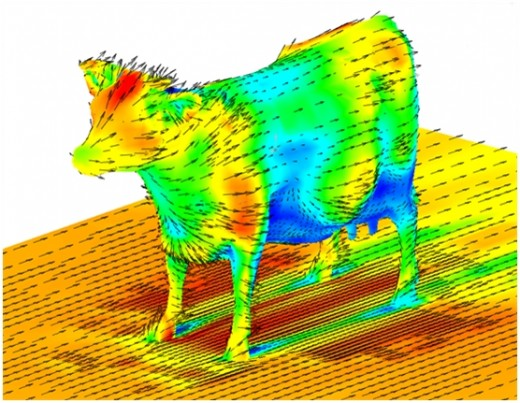

# Tipos e Arquiteturas

Diversos são as finalidades dos sistemas distribuídos que construímos, assim como são diversas as arquiteturas que usamos.
Classificar os tipos e arquiteturas nos ajuda a pensar sobre sistemas e a encontrar e reusar soluções previamente testadas. 

## Tipos

### Sistemas de Computação - High Performance Computing

A possibilidade de agregar poder de processamento de muitos computadores em um rede de comunicação com altíssima largura de banda nos permite atacar problemas computacionalmente muito intensos.
Clusters como o da imagem a seguir são compartilhados por pesquisadores resolvendo problemas áreas como bio-informática, engenharia, economia, inteligência artificial, etc.


Na engenharia, por exemplo, HPC pode ser usada para testar a eficiência de projetos sem construir protótipos, seja
* de uma turbina <br>

* um carro <br>

* ou uma vaca <br>



### Sistemas de Informação

Provavelmente mais comuns entre os profissionais da computação, os sistemas de informação distribuídos permitem a são encontrados em diversas formas (de fato, o termo "sistema de informação" é tão abrangente, que dificilmente um sistema distribuído não estaria nesta classe.).


O seguinte é um exemplo de uma arquitetura em três camadas, onde a primeira camada faz interface com o usuário, a segunda camada contém a lógica do negócio, e a terceira camada mantem os dados.

[](https://en.wikipedia.org/wiki/Multitier_architecture)

Peça fundamental desta abordagem, os bancos de dados na terceira camada são, muito frequentemente, transacionais.
Isto é, eles provêem as seguintes garantias na execução de transações, as famosas propriedades ACID:

---

* Atomicidade: transações são tratadas de forma indivisível, isto é, ou tudo ou nada.
*  Consistência: transações levam banco de um estado consistente a outro<br>
	E.g., x == 2*y
* Isolamento: transações não vêem dados não comitados umas das outras.
* Durabilidade: os efeitos de uma transação comitada devem persistir no sistema a despeito de falhas.

---

Para relembrar o que querem dizer as propridades, considere a seguinte sequência de operações:

```
1: a = SELECT X
2: c = a * 2
3: b = c + 10
4: SET X=c
5: SET Y=b
````
Suponha duas instâncias desta sequência, $T_1$ e $T_2$, concorrentes, em que as operações escalonadas da seguinte forma, onde $T_x^y$ é a y-ésima operação de $T_x$.

$T_1^1, T_1^2, T_1^3, T_1^4, T_2^1, T_2^2, T_2^3, T_2^4, T_2^5, T_1^5$

Ao final da execução, X terá o valor atribuído por $T_2$, mas $Y$ terá o valor de $T_1$. 
Este escalonamento violou a consistência do banco de dados por quê as operações não foram executadas isoladamente.


\includegraphics[width=.6\textwidth]{images/nosql}
\href{https://www.algoworks.com/blog/nosql-database/}{Fonte}
\end{frame}

Tente imaginar a dificuldade de se implementar um banco de dados distribuído.


\begin{frame}[allowframebreaks]{Integração de aplicações}{Sistemas de Informação Distribuído}
\includegraphics[width=.6\textwidth]{images/01-11}

\framebreak

\includegraphics[width=.6\textwidth]{images/mq}

\href{https://www.codeproject.com/articles/297162/introducing-expert-systems-and-distributed-archite}{Fonte}

\href{https://engineering.linkedin.com/distributed-systems/log-what-every-software-engineer-should-know-about-real-time-datas-unifying}{Mais}
\end{frame}

\begin{frame}[allowframebreaks]{Sistemas Pervasivos/Ubíquos}
\begin{quotation}
Ubiquitous computing is the method of enhancing computer use by making many computers available throughout the physical environment, but making them effectively invisible to the user".( Weiser 1993).
\end{quotation}

Foco na tarefa em vez de na ferramenta.
%	The goal of pervasive computing is to make people thinking about the task rather than the tool of computer.

\framebreak

\begin{itemize}
\item Detecção de contexto.
\item Composição ad-hoc
\item Compartilhamento
\end{itemize}

\href{https://youtu.be/M08fVm6zVyw}{Smart Life}

\href{https://www.youtube.com/watch?v=zdbumR6Bhd8}{Amazon Go}

\href{https://youtu.be/RJ4KxaWraJc}{Reality check}

\framebreak

\begin{itemize}
\item \alert{Internet das coisas}
\item Realidade aumentada
\item Smart grid\\
E.g., lavadora que escolhe horário
\end{itemize}

\framebreak

\includegraphics[width=0.6\textwidth]{images/01-12}
\begin{itemize}
\item \alert{Segurança e privacidade}
\item Ghost in the shell? Snow crash? % (Neil Stephenson)?
\end{itemize}	
\end{frame}


\begin{frame}[allowframebreaks]{Redes de Sensores}
\begin{itemize}
\item Movimentação de tropas e de fauna
\item Índices de poluição
\item Abalos sísmicos e predição de avalanches
\item Indoors e outdoors
\end{itemize}	
\framebreak

\includegraphics[width=0.6\textwidth]{images/01-13}

\end{frame}

\begin{frame}[fragile]{Sistemas de Computação}{Nuvens}
\url{https://www.google.com/about/datacenters/gallery/#/all}
\end{frame}


\subsection{Arquiteturas}


\begin{frame}[allowframebreaks]{Arquitetura}

	\begin{quotation}
		“... an architectural style determines the vocabulary of components and connectors that can be used in instances of that style, together with a set of constraints on how they can be combined. These can include topological constraints on architectural descriptions (e.g., no cycles). Other constraints—say, having to do with execution semantics—might also be part of the style definition.”
	\end{quotation}
	 \href{http://www.cs.cmu.edu/afs/cs/project/able/ftp/intro_softarch/intro_softarch.pdf]}{David Garlan and Mary Shaw, January 1994, CMU-CS-94-166, em ``An Introduction to Software Architecture}
	 	 
	 \framebreak
	 
Um estilo ou padrão arquitetural é o conjunto de princípios que provê uma infraestrutura abstrata para uma família de sistemas.
	 
Promove reuso de projeto ao prover soluções para problemas recorrentes e frequentes.
	 
	 \href{https://msdn.microsoft.com/en-us/library/ee658117.aspx}{Fonte}
	 
\end{frame}

\begin{frame}{Componentes e Conectores}
\includegraphics[width=1\textwidth]{images/components}
\end{frame}


\begin{frame}{Layers e Objetos}
\includegraphics[width=1\textwidth]{images/02-01}
\end{frame}


\begin{frame}{Desacoplamento Espacial e Temporal}
\includegraphics[width=1\textwidth]{images/component2}

Orientação a eventos e a dados.
\end{frame}

\begin{frame}
Comunicação x Papéis
\end{frame}


\begin{frame}[allowframebreaks]{Cliente/Servidor}{1 x 1 ou n x 1}
\begin{itemize}
	\item Servidor: oferece serviço.
	\item Cliente: usa serviço.
	\item Possivelmente em máquinas distintas
\includegraphics[width=0.6\textwidth]{images/cs}\\
\href{http://psspol.blogspot.com.br/2015/07/difference-between-client-server.html}{Fonte}

\framebreak
	\item Request/Reply\\
\includegraphics[width=0.6\textwidth]{images/02-03}


\alert{Oportunidade para computação assíncrona!}

\framebreak

	\item Cliente multi-thread: 
	\item Servidor multi-thread: múltiplos clientes\\
	Concorrência, Isolamento, multi-tenancy, 
\end{itemize}
\end{frame}

\begin{frame}{Cliente Servidor}{n x n}
\includegraphics[width=0.7\textwidth]{images/lb}

\href{http://blogs.softchoice.com/itgrok/client/one-egg-many-baskets/}{Fonte}

E.g., Sistemas bancários. Netflix.
\end{frame}


\begin{frame}[allowframebreaks]{Peer-2-Peer}{n x n}
	\begin{itemize}
		\item Colaboradores/Pares, em vez de clientes e servidores.
		\item E.g., Gnutella, Limewire, Shareazade, Napster... \\
		\alert{Todos vão para a cadeia juntos!}
	\end{itemize}

\framebreak

\includegraphics[width=.6\textwidth]{images/chord}	

\end{frame}


\begin{frame}[allowframebreaks]{Híbridos}
\begin{itemize}
	\item Clientes, servidores, pares, super-pares, tudo junto e misturado.\\
	
	\item CassandraDB, por exemplo, é um banco de dados P2P, que serve a múltiplos clientes, de diversas aplicações distintas, ao mesmo tempo.\\
	\href{https://www.atlassian.com/blog/archives/do-you-know-cassandra}{CassandraDB, em quadrinhos! }
	
	
	\item Massively Multiplayer Online Games.
\end{itemize}

\framebreak 
\note{Considere o exemplo apenas dado do bittorrent}

\begin{block}{Bittorrent}
\includegraphics[width=1\textwidth]{images/02-14}
%\includegraphics[width=.6\textwidth]{images/bittorrent}
\end{block}

\framebreak

\note{Voltando mais atrás, o exemplo de sistema de informação cliente servidor}

\begin{block}{Sistema de informação}
\includegraphics[width=1\textwidth]{images/01-10}	
\end{block}
	
\end{frame}


\begin{frame}[allowframebreaks]{Tiers}

\begin{block}{3-Tiers}

	\includegraphics[width=1\textwidth]{images/3tierb}	
\end{block}

\href{https://managementmania.com/en/three-tier-architecture}{Fonte}

\framebreak

\note{Interessante notar que a arquitetura do software pode ser independente da disposição física.}

\begin{block}{2-Tiers}
	\includegraphics[width=1\textwidth]{images/02-05}	
\end{block}

\framebreak

\begin{block}{Múltiplos tiers}
	\includegraphics[width=1\textwidth]{images/02-04}	
\end{block}


\framebreak


\begin{block}{Microserviços}
	\includegraphics[width=1\textwidth]{images/microservices}
\end{block}

\framebreak

\begin{block}{Microserviços}
	\includegraphics[width=1\textwidth]{images/microservice_sample}
\end{block}

Fonte: desconhecido.


\framebreak

\href{http://www.zdnet.com/article/microservices-101-the-good-the-bad-and-the-ugly/}{Leia mais}	

\end{frame}


\begin{frame}{Microserviços}{A rede por trás}
\begin{block}{Facebook Fabric}
	\url{https://www.youtube.com/watch?v=mLEawo6OzFM}
\end{block}
\end{frame}

\begin{frame}
\href{https://keetmalin.wixsite.com/keetmalin/single-post/2017/09/27/Distributed-System-Architectures-and-Architectural-Styles}{Leia mais sobre aquitetura}
\end{frame}

\frame{Fim da aula 3}