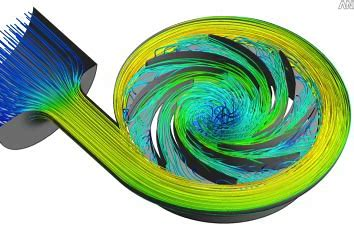
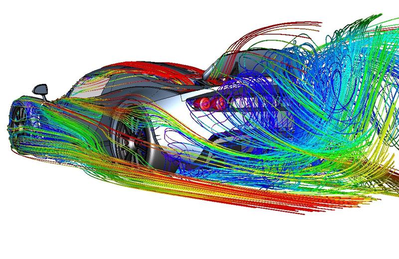
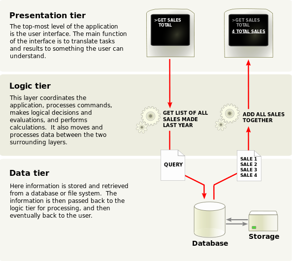
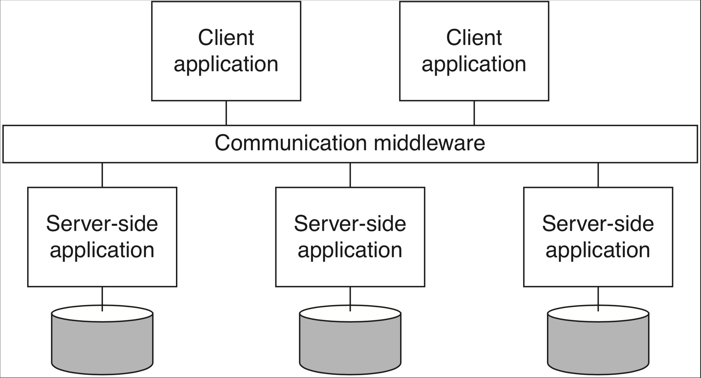
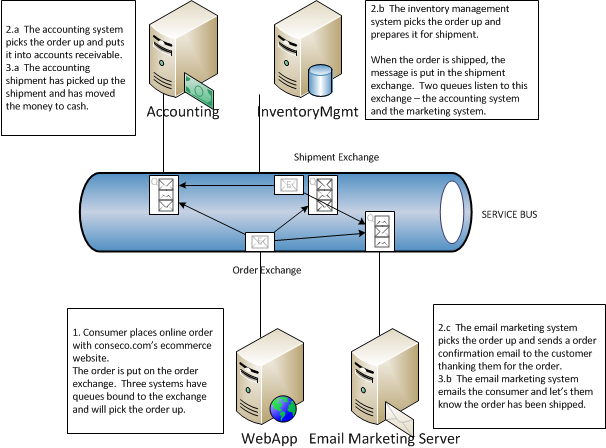
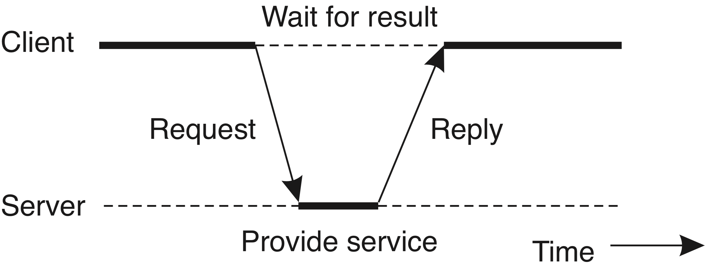
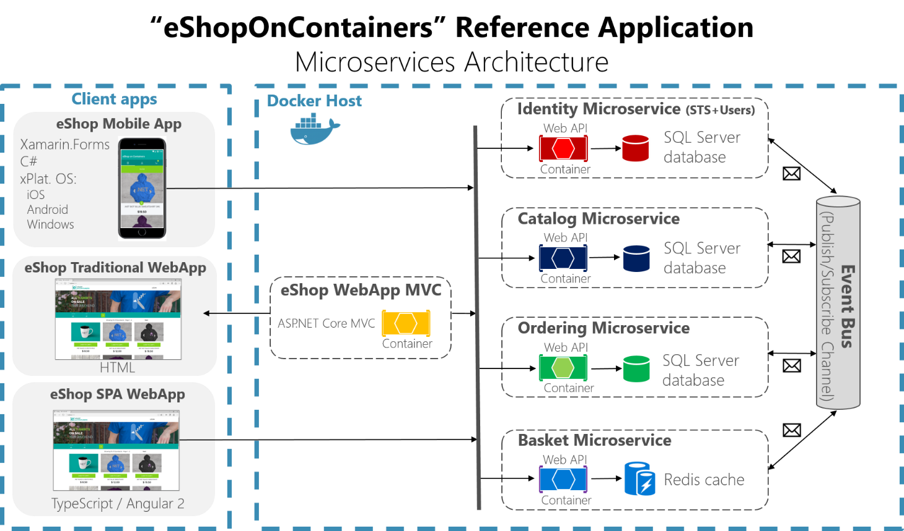

# Tipos e Arquiteturas

Diversos são as finalidades dos sistemas distribuídos que construímos, assim como são diversas as arquiteturas que usamos.
Classificar os tipos e arquiteturas nos ajuda a pensar sobre sistemas e a encontrar e reusar soluções previamente testadas. 

## Tipos

### Sistemas de Computação - High Performance Computing

A possibilidade de agregar poder de processamento de muitos computadores em um rede de comunicação com altíssima largura de banda nos permite atacar problemas computacionalmente muito intensos.
Clusters como o da imagem a seguir são compartilhados por pesquisadores resolvendo problemas áreas como bio-informática, engenharia, economia, inteligência artificial, etc.


Na engenharia, por exemplo, HPC pode ser usada para testar a eficiência de projetos sem construir protótipos, seja
* de uma turbina <br>

* um carro <br>

* ou uma vaca <br>


### Sistemas de Informação

Provavelmente mais comuns entre os profissionais da computação, os sistemas de informação distribuídos permitem a são encontrados em diversas formas (de fato, o termo "sistema de informação" é tão abrangente, que dificilmente um sistema distribuído não estaria nesta classe.).


O seguinte é um exemplo de uma arquitetura em três camadas, onde a primeira camada faz interface com o usuário, a segunda camada contém a lógica do negócio, e a terceira camada mantem os dados.

[](https://en.wikipedia.org/wiki/Multitier_architecture)

Peça fundamental desta abordagem, os bancos de dados na terceira camada são, muito frequentemente, transacionais.
Isto é, eles provêem as seguintes garantias na execução de transações, as famosas propriedades ACID:

---

* Atomicidade: transações são tratadas de forma indivisível, isto é, ou tudo ou nada.
*  Consistência: transações levam banco de um estado consistente a outro<br>
	E.g., x == 2*y
* Isolamento: transações não vêem dados não comitados umas das outras.
* Durabilidade: os efeitos de uma transação comitada devem persistir no sistema a despeito de falhas.

---

Para relembrar o que querem dizer as propridades, considere a seguinte sequência de operações:

```
1: a = SELECT X
2: c = a * 2
3: b = c + 10
4: SET X=c
5: SET Y=b
````
Suponha duas instâncias desta sequência, $T_1$ e $T_2$, concorrentes, em que as operações escalonadas da seguinte forma, onde $T_x^y$ é a y-ésima operação de $T_x$.

$T_1^1, T_1^2, T_1^3, T_1^4, T_2^1, T_2^2, T_2^3, T_2^4, T_2^5, T_1^5$

Ao final da execução, X terá o valor atribuído por $T_2$, mas $Y$ terá o valor de $T_1$. 
Este escalonamento violou a consistência do banco de dados por quê as operações não foram executadas isoladamente.


Tente imaginar a dificuldade de se implementar um banco de dados distribuído. Isto é, um banco em que vários nós mantem os dados, participam de transações e, portanto, precisam coordenar-se para manter os dados consistentes. A figura abaixo mostra um cenário com três bancos. Imagine que em um deles está uma relação com os dados dos clientes. Em outro, os dados do estoque. Finalmente, no terceiro nó, temos ordens de compra. Quando um cliente faz um pedido, o cliente deve ser validado no primeiro nó, o item é removido do estoque no segundo nó, e no terceiro é disparada uma cobrança para o cliente. Se qualquer destas três relações não for corretamente consultada e alterada, os efeitos podem ser catastróficos para o negócio.


Como implementar ACID neste banco de dados? Embora veremos isso um pouco mais para frente neste material, por enquanto, apenas assuma que não é exatamente fácil ou barato. Esta dificuldade foi a razão do surgimento dos bancos de dados NOSQL (née NoSQL).


Em tempo, discutiremos como estes bancos de dados funcionam, quando falarmos sobre sistemas P2P.


#### Integração de Aplicações

Frequentemente é necessário integrar sistemas de informação legados com sistemas mais modernos, ou simplesmente expô-los usando uma interface mais moderna. Nestes casos, pode ser possível integrar diversos sistemas usando um *middleware* que os encapsule.



O *middleware* pode, por exemplo, se expor via interface REST para os clientes, mas consultar o sistema legado em um padrão antigo.

Outro exemplo é o sistema na imagem seguinte, que mostra diversos departamentos de um empresa conversando via troca de mensagens. Observe que nenhum departamento precisa conversar diretamente com os outros, ou mesmo conhecê-los. Eles apenas publicam a mensagem para quem puder tratar. Da mesma forma, a resposta vem na forma de uma mensagem.




Siga este [link](https://engineering.linkedin.com/distributed-systems/log-what-every-software-engineer-should-know-about-real-time-datas-unifying) para ler mais sobre este tipo de sistema.

### Sistemas Pervasivos/Ubíquos

Segundo Weiser, 1993
> Ubiquitous computing is the method of enhancing computer use by making many computers available throughout the physical environment, but making them effectively invisible to the user".

O que é importante aqui é o foco na tarefa em vez de na ferramenta. Assim, sistemas pervasivos devem ajudar as pessoas a realizar suas tarefas, de forma implícita, sem ter que pensar em como a tarefa será executada.
Para que seja realizada, a computação pervasiva requer que dispositivos **detectem o contexto** em que estão inseridos, **combinem-se de forma *ad-hod*** e **compartilhem informações**.

Alguns exemplos interessantes de computação pervasiva.

#### Smart Life

<iframe width="560" height="315" src="https://www.youtube.com/embed/M08fVm6zVyw" frameborder="0" allow="accelerometer; autoplay; encrypted-media; gyroscope; picture-in-picture" allowfullscreen></iframe>

#### Amazon Go

<iframe width="560" height="315" src="https://www.youtube.com/embed/zdbumR6Bhd8" frameborder="0" allow="accelerometer; autoplay; encrypted-media; gyroscope; picture-in-picture" allowfullscreen></iframe>

#### Minority Report

E, para quem já viu Minority Report, aqui vai um reality check.

<iframe width="560" height="315" src="https://www.youtube.com/embed/RJ4KxaWraJc" frameborder="0" allow="accelerometer; autoplay; encrypted-media; gyroscope; picture-in-picture" allowfullscreen></iframe>

#### Redes de Sensores e Internet das Coisas

Eu vou me arriscar colocando Redes de Sensores e Internet das Coisas como uma subsessão de Sistemas Pervasivos.
Isto porquê, a meu ver, as redes de sensores são parte da infraestrutura para se obter sistemas pervasivos; são os sensores que percebem mudanças contexto e "leêm" o estado do contexto atual e alimentam outros sistemas que reagem a tal estado.
A Internet das Coisas (IoT, do inglês *Internet of Things) vai também na mesma linha, levando à integração entre sensores, atuadores, e outros dispositivos que nos servem, em um ambiente de computação pervasiva.
"Mas se é assim, qual o risco?", você pergunta. Bem, a Internet das Coisas pode ser vista como algo além dos sistemas pervasivos, pois se estes últimos são focados nos humanos em um certo contexto, a IoT não necessariamente foca-se nos humanos, mas na realização de alguma tarefa. 
Por exemplo, um sistema de irrigação que percebe o nível de humidade do ar, analisa previsões de chuva e decide em quanto irrigar uma plantação de laranjas provavelmente não se importará com a presença ou não de um humano na plantação.


Para ler mais sobre IoT, veja este [link](https://publications.europa.eu/en/publication-detail/-/publication/ed079554-72c3-4b4e-98f3-34d2780c28fc) que descreve diversos projetos europeus na área.


<h1> TODO Alguns exemplos de IoT e redes de sensores</h1>

* Smart grid e lavadora que escolhe horário
* Termostatos que percebem movimento
* Fechaduras que se abrem quando o dono se aproxima
* Movimentação de tropas e de fauna
* Índices de poluição
* Abalos sísmicos e predição de avalanches
* [link](https://beebom.com/examples-of-internet-of-things-technology/)


#### Uma nota sobre privacidade nos sistemas pervasivos

À medida em que aumentamos o ambiente ao nosso redor ou a nós mesmos com dispositivos computacionais, por um lado facilitamos nossa vida pois somos assistidos por tais dispositivos, mas por outro, nos tornamos cada vez mais dependentes nos mesmos, com sérios riscos à nossa privacidade.
Isto ocorre por que para que realizem suas tarefas, os sistemas pervasivos precisam de cada vez mais informações sobre nós, e há sempre o risco de que estas informações sejam usadas de forma que não nos apetece.

<h1> TODO Exemplos de problemas de privacidade. </h1>

* [Roomba mapeando sua casa](https://www.nytimes.com/2017/07/25/technology/roomba-irobot-data-privacy.html).
* Ghost in the shell
* Snow crash (Neil Stephenson)

### Computação Utilitária

Um tipo importante de sistema distribuído mais recente são as nuvens computacionais, usadas no provimento de computação utilitária.
Este tipo de sistema, embora possa ser pensando como infraestrutura para outros sistemas distribuídos, são, na verdade, complexas peças de engenharia, com diversos subsistemas responsáveis por sincronização de relógios, monitoração de falhas, coleta de logs, roteamento eficiente tolerante a falhas e por aí vai.

O seguinte vídeo mostra, em 360 graus, um dos datacenters do Google, para que você tenha ideia da escala em que estes sistemas são construídos.

<iframe width="560" height="315" src="https://www.youtube.com/embed/zDAYZU4A3w0" frameborder="0" allow="accelerometer; autoplay; encrypted-media; gyroscope; picture-in-picture" allowfullscreen></iframe>

Para uma viagem fotográfica, siga este [link](https://www.google.com/about/datacenters/gallery/#/all)


## Arquiteturas

De acordo com David Garlan and Mary Shaw, January 1994, CMU-CS-94-166, em [*An Introduction to Software Architecture*](http://www.cs.cmu.edu/afs/cs/project/able/ftp/intro_softarch/intro_softarch.pdf)
> ... an architectural style determines the vocabulary of components and connectors that can be used in instances of that style, together with a set of constraints on how they can be combined. These can include topological constraints on architectural descriptions (e.g., no cycles). Other constraints—say, having to do with execution semantics—might also be part of the style definition.

Em outras palavras, um estilo ou padrão arquitetural é o conjunto de princípios que provê uma infraestrutura abstrata para uma família de sistemas, e promove o reuso de projeto ao [prover soluções para problemas recorrentes e frequentes](https://msdn.microsoft.com/en-us/library/ee658117.aspx).

### Componentes e Conectores

Quando falamos sobre arquiteturas em sistemas distribuídos, estamos primariamente focados na forma como componentes se conectam, por meio de conectores, para implementar a solução para um problema.


Dependendo de como são conectados, haverá maior ou menor dependência entre os componentes.
Quando houver forte dependência, diremos que os componentes estão **fortemente conectados** (*tightly coupled*). Caso contrário, diremos que estão **fracamente conectados** (*loosely coupled*).
A razão óbvia para preferir sistemas fracamente conectados é sua capacidade de tolerar disrupções; se um componente depende pouco de outro, então não se incomodará com sua ausência por causa de uma falha.

Certos *middleware* permitem um acoplamento tão fraco entre componentes, que estes não precisam se conhecer ou sequer estarem ativos no mesmo momento.


Também a questão da simplificação de API, uma vez que o *middleware* pode impor um padrão a ser seguido por todos os componentes, e com isso minimizar a necessidade os componentes conhecerem as interfaces uns dos outros.


### Cliente/Servidor

A forma como os componentes se comunicam, isto é, os conectores usados, é importante no estudo arquitetural. Mas também são importantes os papéis assumidos pelos componentes na realização de tarefas.
Neste sentido, provavelmente a arquitetura de computação distribuída mais famosa é a **Cliente/Servidor**.

Na arquitetura Cliente/Servidor, como implicado pelo nome, há um processo que serve a pedidos realizados por outros processos. 
Isto é feito quando o **cliente** o contacta o servidor e requer (*request*) a realização do serviço.
O **servidor**, por sua vez, pode desempenhar tarefas como fazer cálculos, armazenar dados, ou repassar uma mensagem e, ao final da realização da tarefa, responder (*response*) ao cliente.

Um mesmo servidor pode atender a diversos clientes e, geralmente, a comunicação entre os mesmos é feita diretamente por sockets.


Embora seja possível usar sockets de forma assíncrona, a API mais comum é síncrona, isto é, quando um processo espera receber uma mensagem de outro, ele fica bloqueado esperando algum dado estar disponível para leitura no referido socket.
Assim, geralmente a comunicação entre cliente e servidor segue o seguinte esquema:



Observe que o cliente fica inativo enquanto espera a resposta e que o servidor fica inativo enquanto espera outras requisições.
Para minimizar os períodos de inatividade, o cliente pode usar o socket assíncronamente, o que não é exatamente simples, ou usar múltiplos threads, para que continue operando mesmo enquanto um thread estiver bloqueado esperando a resposta do servidor.

No lado do servidor, o minimização da ociosidade é feita pelo uso de múltiplos clientes, concorrentes, e também pelo uso de múltiplos threads.
Neste caso, contudo, é necessário tomar muito cuidado para garantir que a concorrência não causará efeitos indesejados nos dados e execução das tarefas.
Veja o caso de um banco de dados transacional, por exemplo, como discutido acima; ele precisa garantir ACID entre as transações propostas pelos clientes.

Embora tenhamos colocado aqui apenas um servidor atendendo aos clientes, em muitas aplicações modernas, múltiplos servidores atenderão ao conjunto de clientes.
Pense por exemplo no serviço de email do Google, o Gmail. Com os milhões de usuários que tem, certamente há mais de um servidor implementando o serviço.
Provavelmente estes diversos servidores ficam atrás do que chamamos de um balanceador de cargas, que roteia as requisições seguindo diferentes políticas, por exemplo, *round robin*.


### Par-a-Par (P2P)

Diferentemente de sistemas cliente/servidor, em que um nó serve o outro, em sistemas par-a-par, nos nós são parceiros e tem igual responsabilidade (e daí o nome) na execução das tarefas.

Diversos sistemas P2P existem, sendo, provavelmente, os mais famosos, os sistemas de compartilhamento de arquivos.
Nesta linha, embora diversos tenham existido, hoje o mais famoso é o Bittorrent, embora, como veremos adiante, o mesmo não seja exatamente P2P.

Outro exemplo importante por ter inspirado diversos outros sistemas é o Chord. 
Neste sistema, nós organizam-se em um anel lógico e cada um se torna responsável por um dos segmentos do anel adjacente a onde se encontra no mesmo.
Requisições para correspondentes a um segmento são roteados para o nó responsável usando uma tabela de rotas conhecida como *finger table*.
Se traçarmos os caminhos apontados por esta tabela sobre o anel, desenharemos **cordas** sobre o mesmo, o que explica o nome do sistema.


### Híbridos

Embora cliente/servidor e P2P sejam arquiteturas clássicas, boa parte dos sistemas que distribuídos podem ser na verdade consideradas híbridos.
Considere um sistema de email, por exemplo. Embora clientes usem as funcionalidades dos servidores de email para enviar e receber mensagens, os servidores conversam uns com os outros para implementar a tarefa de encaminhar as mensagens. Neste sentido, o sistema é um híbrido P2P e cliente/servidor.

Outros exemplos abundam.

* Bancos de dados, e.g., DynamoDB, [CassandraDB](https://www.atlassian.com/blog/archives/do-you-know-cassandra), Redis,...
* Jogos multiplayer (pense no [particionamento dos mapas](http://pages.cs.wisc.edu/~vshree/cs740/Voronoi.pdf))
* Compartilhamento de arquivos: Bittorrent

Considere este último exemplo, do Bittorrent. Observe na figura adiante os diversos passos necessários à recuperação do arquivo de interesse.


Voltando ao exemplo do sistema de informação, observe que o cliente acessa um serviço, implementado por pares de nós. 
Podemos dizer que também este é híbrido.


### Sistemas multi-camadas

Outra forma de hibridismo que podemos citar é quando um componente haje tanto como cliente quanto como servidor. 
Veja o seguinte exemplo, conhecido no meio como arquitetura em 3-camadas (3 *tiers*).

[](https://managementmania.com/en/three-tier-architecture)

Neste caso, é interessante notar que esta disposição dos componentes é independente da disposição física. De fato, as três camadas podem estar em um mesmo nó, ou combinadas duas a duas, neste último caso resultando em duas camadas.


Por outro lado, cada camada pode ser subdividida em mais componentes, resultando é múltiplos tiers, como neste exemplo de um sistema de busca na Web.


### Micro-serviços

Finalmente, chegamos aos sistemas micro-serviços, em que os sistemas existem independentemente, cada um com suas camadas e cada um resolvendo um problema em específico, mas todos contribuindo para a realização de uma tarefa maior.



Nós discutiremos micro-serviços mais adiante. Por agora, apenas tenha em mente que embora seja vendido por muitos como tal, [os micro-serviços não são uma panacéia](http://www.zdnet.com/article/microservices-101-the-good-the-bad-and-the-ugly/).

## Para aprender mais

Para aprender mais sobre arquiteturas, consulte a seguinte referência: [Distributed System Architectures and Architectural Styles](https://keetmalin.wixsite.com/keetmalin/single-post/2017/09/27/Distributed-System-Architectures-and-Architectural-Styles).

Para aprender um pouco sobre como funcionam as redes de um datacenter, definidas por software, assista ao seguinte vídeo, que fala sobre a infra-estrutura do Facebook.

<iframe width="560" height="315" src="https://www.youtube.com/embed/mLEawo6OzFM" frameborder="0" allow="accelerometer; autoplay; encrypted-media; gyroscope; picture-in-picture" allowfullscreen></iframe>
