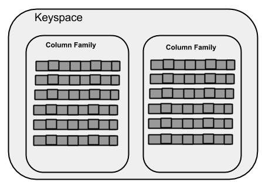

O CassandraDB se aproxima do modelo relacional, facilitando o desenvolvimento de certas aplicações, sem perder as características desejáveis das DHT.

A principal característica neste sentido é o modelo híbrido chave-valor/relacional, em que os valores associados a uma chave são divididos em colunas.
A combinação chave-colunas são denominadas **column-families** e seu conjunto **keyspace**. Estas duas estruturas são equivalente às tabelas/relações e aos bancos de dados, dos bancos de dados  relacionais. 

Uma diferença fundamental entre column-families e relações é que as últimas precisam de um esquema pré-definido, enquanto que as primeiras não tem um esquema. Isto quer dizer que novas colunas podem ser adicionadas dinamicamente e que nem todas precisam estar presentes para cada chave. De fato, múltiplos registros com a mesma chave, ou linhas, podem ter conjuntos de colunas diferentes.

Para que o correto conjunto de colunas associado a uma chave possa ser apurado, após múltiplas escritas com a mesma chave tenham ocorrido, a cada tupla (chave,coluna,valor) é associado também um *timestamp*. 
. Assim, dados uma mesma chave e coluna, o valor válido é o com o maior timestamp.

Dentro de um nó, entradas são ordenadas por chaves, possivelmente compostas com os valores de algumas colunas (**chave composta**). 

Para facilitar mais ainda o desenvolvimento, o Cassandra conta com uma linguagem de consulta similar ao SQL (Structured Query Language), a CQL (Cassandra Query Language).

Para aprender mais sobre o Cassandra, visite o sítio do projeto, [aqui](http://wiki.apache.org/cassandra/GettingStarted), ou explore uma das muitas aplicações *Open Source* que o usam, por exemplo, o clone de Twiter [Twissandra](https://github.com/twissandra/twissandra)